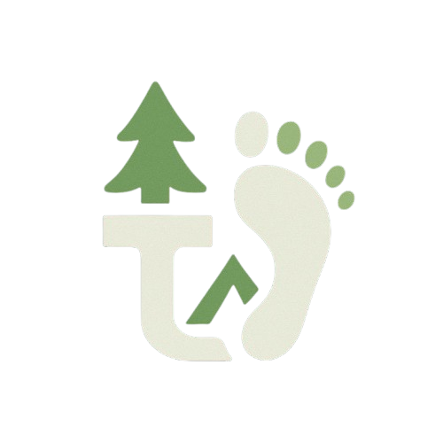

⛰️ Tapak Jejak - Mountain Adventure Companion

_Your Ultimate Hiking & Outdoor Gear Platform_

---


---

## 📱 Tentang Aplikasi

**Tapak Jejak** adalah aplikasi mobile one-stop solution untuk para pendaki dan pecinta alam di Indonesia. Dibangun dengan Flutter, aplikasi ini menyediakan pengalaman yang komprehensif mulai dari sewa alat outdoor, panduan tutorial, hingga AI assistant yang siap membantu perjalanan pendakian Anda!

Dengan **Marsha AI Assistant** yang powered by Google Gemini, sistem **Quest & Gamification** yang engaging, dan berbagai fitur canggih lainnya - Tapak Jejak adalah teman setia untuk setiap petualangan Anda! 🏔️

---

## ✨ Fitur Utama

### 🤖 Marsha AI Assistant - Powered by Google Gemini

Asisten pendakian pintar yang siap membantu 24/7!

- **Conversational AI** - Chat natural dengan AI yang memahami konteks pendakian
- **Expert Guidance** - Saran perencanaan pendakian, route, safety tips
- **Equipment Recommendation** - Rekomendasi peralatan sesuai kebutuhan
- **Weather Insights** - Info cuaca dan kondisi jalur gunung
- **Animated Avatar** - Karakter Marsha dengan berbagai expressions
  - 😊 Greeting (wave animation)
  - 🤔 Thinking (processing)
  - 💡 Explaining (with gestures)
  - 👍 Encouraging
  - ⚠️ Warning (safety alerts)
- **Quick Actions** - Shortcut untuk pertanyaan populer:
  - 🏔️ Rekomendasi Gunung Pemula
  - 🎒 Checklist Peralatan Wajib
  - ⚠️ Safety Tips Pendakian
  - 🌤️ Waktu Terbaik Mendaki
- **Glassmorphism UI** - Modern blur background dengan slide animation
- **Drag to Close** - Swipe down gesture untuk menutup chat

### 🎮 Quest & Gamification System

Jadikan setiap aktivitas lebih menyenangkan dengan sistem reward!

#### 🏆 Quest Types:

**Daily Quests** - Reset setiap hari:

- 🔍 **Jelajahi Katalog** - Lihat 5 produk (+20 poin)
- 📖 **Baca Tutorial** - Baca 1 tutorial pendakian (+30 poin)
- 🌤️ **Check Cuaca** - Cek cuaca perjalanan (+15 poin)

**Weekly Quests** - Reset setiap minggu:

- 🛒 **Rental Pertama** - Sewa alat outdoor (+100 poin)
- 🛍️ **Shopping Spree** - Beli 3 produk (+150 poin)
- ❤️ **Explorer** - Tambahkan 5 gunung ke wishlist (+50 poin)

**Achievements** - Milestone jangka panjang:

- ⛰️ **Pendaki Pemula** - Selesaikan trip pertama (+200 poin)
- ⭐ **Reviewer Aktif** - Tulis 5 review produk (+100 poin)
- 💎 **Loyal Customer** - Belanja 10 kali (+300 poin)
- 🏅 **Master Climber** - Capai level Platinum (+500 poin)

#### 🏔️ Mountain Climber Game

Visual gamification interaktif!

- **4 Checkpoint System**: Base Camp → Camp 1 → Camp 2 → Summit
- **Animated Avatar** - Pendaki yang bergerak sesuai progress poin
- **Smooth Animation** - Transisi halus antar checkpoint
- **Real-time Progress** - Update langsung setiap aktivitas
- **Next Milestone Tracker** - Card yang menampilkan target selanjutnya

#### 💎 Membership Levels

| Level           | Points    | Discount | Benefits                                         |
| --------------- | --------- | -------- | ------------------------------------------------ |
| 🥉 **Bronze**   | 0-500     | 5%       | Diskon 5%, Tutorial basic                        |
| 🥈 **Silver**   | 501-1000  | 10%      | Diskon 10%, Free shipping >250k                  |
| 🥇 **Gold**     | 1001-1500 | 15%      | Diskon 15%, Free shipping >500k, Event access    |
| 💎 **Platinum** | 1501+     | 20%      | Diskon 20%, Free shipping unlimited, VIP support |

### 🛒 Sewa Alat Outdoor (Rental System)

E-commerce lengkap untuk peralatan outdoor!

- **Multi-Brand Support** - 5 Brand ternama:

  - 🎒 **Eiger** - Adventure gear terpercaya
  - 🏕️ **Consina** - Camping equipment lengkap
  - ⛰️ **Arei** - Outdoor apparel & gear
  - 🥾 **Carumby** - Footwear specialist
  - 🧗 **Antarestar** - Technical climbing gear

- **Product Features**:

  - Kategori lengkap (Tenda, Carrier, Sleeping Bag, Jaket, dll)
  - Filter by brand & price
  - Product images & detailed specs
  - Stock availability real-time
  - Rating & reviews

- **Shopping Experience**:
  - ❤️ **Wishlist** - Save produk favorit
  - 🛒 **Shopping Cart** - Keranjang belanja dengan subtotal
  - 📦 **Rental Duration** - Pilih durasi sewa (hari)
  - 💳 **Checkout** - Proses pemesanan smooth

### 🎫 Tiket Masuk Gunung

Beli tiket pendakian langsung dari app!

- **Gunung Populer** - Info & harga tiket berbagai gunung di Indonesia
- **Weekday/Weekend Pricing** - Harga berbeda hari biasa & weekend
- **Booking System** - Pemesanan tiket online
- **E-Ticket** - Tiket digital siap pakai

### 🚗 Travel & Ojek

Transportasi menuju basecamp!

- **Travel Antar Kota** - Booking travel ke lokasi pendakian
- **Ojek Lokal** - Ojek dari kota ke basecamp
- **Real Pricing** - Harga transparan
- **Booking History** - Track pesanan transportasi

### 📚 Tutorial Pendakian

Panduan lengkap untuk pendaki!

**Tutorial Categories**:

- 🏕️ **Build Tenda** - Cara pasang tenda dengan benar
- 🎒 **Packing Carrier** - Tips packing efisien
- 🌿 **Flora & Fauna** - Pengenalan alam di gunung
- 🧭 **Kompas Navigation** - Cara menggunakan kompas
- 🥾 **Hiking Tips** - Teknik mendaki yang baik
- 👥 **P3K Pendakian** - First aid di gunung

**Features**:

- Gambar ilustrasi lengkap
- Step-by-step guide
- Tracking reading progress (untuk quest)
- Bookmark tutorial favorit

### 🌤️ Info Cuaca

Real-time weather untuk planning pendakian!

- **GPS Location** - Auto-detect lokasi gunung terdekat
- **Weather API Integration** - Data cuaca real-time
- **7-Day Forecast** - Prediksi cuaca mingguan
- **Weather Details**:
  - 🌡️ Temperature (min/max)
  - 💧 Humidity
  - 💨 Wind speed & direction
  - 🌧️ Precipitation chance
  - ☁️ Cloud coverage
- **Safety Recommendations** - Saran berdasarkan cuaca
- **Best Time Alert** - Notifikasi waktu ideal mendaki

### 📝 Blog & Review

Platform sharing pengalaman!

- **Trip Reports** - Cerita perjalanan pendakian
- **Product Reviews** - Review alat outdoor
- **Photo Gallery** - Galeri foto pendakian
- **Like & Comment** - Interaksi dengan komunitas
- **Rating System** - Beri rating gunung & produk

### 🔔 Smart Notifications

Notifikasi yang intelligent!

- **Push Notifications** - Powered by Awesome Notifications
- **Subscription Reminders** - Reminder membership habis
- **Quest Completion** - Notifikasi quest selesai
- **Weather Alerts** - Peringatan cuaca buruk
- **Promo Notifications** - Info diskon & promo terbaru
- **Custom Scheduling** - Atur waktu notifikasi

### 👤 Profile & Membership

Kelola akun & membership!

- **User Profile** - Data diri & preferences
- **Membership Dashboard** - Status & benefit membership
- **Points History** - Track perolehan poin
- **Order History** - Riwayat transaksi
- **Settings** - Pengaturan app & notifikasi
- **Logout** - Secure logout with confirmation

---

## 🏗️ Arsitektur & Teknologi

### 🛠️ Tech Stack

| Category             | Technology                      |
| -------------------- | ------------------------------- |
| **Framework**        | Flutter 3.9.2                   |
| **Language**         | Dart 3.9.2                      |
| **State Management** | Provider Pattern                |
| **Local Database**   | Hive (NoSQL)                    |
| **Secure Storage**   | Flutter Secure Storage          |
| **AI Integration**   | Google Gemini API               |
| **Maps**             | Flutter Map + OpenStreetMap     |
| **Weather API**      | OpenWeatherMap API              |
| **Notifications**    | Awesome Notifications           |
| **Image Handling**   | Image Picker                    |
| **Location**         | Geolocator + Permission Handler |

### 📦 Dependencies Utama

```yaml
dependencies:
  # State Management & Navigation
  provider: ^6.1.1 # State management

  # AI & API
  google_generative_ai: ^0.4.6 # Gemini AI integration
  http: ^1.2.1 # HTTP requests

  # Database & Storage
  hive: ^2.2.3 # NoSQL database
  hive_flutter: ^1.1.0 # Hive for Flutter
  flutter_secure_storage: ^9.0.0 # Secure key storage
  shared_preferences: ^2.2.2 # Simple data persistence

  # Maps & Location
  flutter_map: ^6.1.0 # Interactive maps
  latlong2: ^0.9.1 # Lat/Long calculations
  geolocator: ^14.0.2 # GPS location
  flutter_compass: ^0.8.0 # Compass for navigation
  permission_handler: ^12.0.1 # Permission management

  # Notifications
  awesome_notifications: ^0.10.1 # Rich notifications

  # UI/UX
  image_picker: ^1.0.7 # Pick images
  intl: ^0.20.2 # Date/time formatting
```

### 🎨 Design Pattern

**Architecture**: MVVM (Model-View-ViewModel) with Provider

- **Model** - Data classes & business logic (`lib/models/`)
- **View** - UI screens & widgets (`lib/screens/`, `lib/widgets/`)
- **ViewModel** - Services & state management (`lib/services/`)

**Key Services**:

- 🤖 `GeminiService` - AI chat integration
- 🎯 `QuestService` - Quest & gamification logic
- 💾 `HiveService` - Database operations
- 🔐 `AuthService` - Authentication & user session
- 🌤️ `WeatherService` - Weather data fetching
- 📍 `LocationService` - GPS & location tracking
- 🔔 `NotificationService` - Push notifications

---

## 🚀 Instalasi & Setup

### Prerequisites

Pastikan sudah terinstall:

- ✅ Flutter SDK 3.9.2 atau lebih baru
- ✅ Dart SDK 3.9.2 atau lebih baru
- ✅ Android Studio / VS Code dengan Flutter extension
- ✅ Android Device/Emulator (API 21+) atau iOS Device/Simulator

### Langkah Instalasi

#### 1️⃣ Clone Repository

```powershell
git clone https://github.com/Zaghasen/PAM_TA.git
cd TAPAK_JEJAK
```

#### 2️⃣ Install Dependencies

```powershell
flutter pub get
```

#### 3️⃣ Setup Google Gemini API Key

1. Buka [Google AI Studio](https://makersuite.google.com/app/apikey)
2. Login dengan Google account
3. Klik "Create API Key"
4. Copy API key yang dihasilkan

**Edit file**: `lib/services/gemini_service.dart`

```dart
static const String _apiKey = 'YOUR_API_KEY_HERE'; // Ganti dengan API key Anda
```

#### 4️⃣ Setup Weather API (Optional)

Jika ingin menggunakan Weather API sendiri:

1. Daftar di [OpenWeatherMap](https://openweathermap.org/api)
2. Dapatkan API key gratis
3. Edit `lib/services/weather_service.dart`

```dart
static const String _apiKey = 'YOUR_WEATHER_API_KEY';
```

#### 5️⃣ Run Application

```powershell
# Development mode
flutter run

# Release mode (Android)
flutter build apk --release

# Release mode (iOS)
flutter build ios --release
```

### 🔧 Build untuk Production

**Android APK**:

```powershell
flutter build apk --release
# Output: build/app/outputs/flutter-apk/app-release.apk
```

**Android App Bundle** (untuk Google Play):

```powershell
flutter build appbundle --release
# Output: build/app/outputs/bundle/release/app-release.aab
```

**iOS**:

```powershell
flutter build ios --release
# Kemudian buka Xcode untuk archive & distribute
```

---

## 📖 Cara Menggunakan Aplikasi

### 1️⃣ Login & Onboarding

**Langkah-langkah:**

1. Buka aplikasi → Masukkan **username** (minimal 3 karakter)
2. Tap tombol **"Login"**
3. Sistem akan:
   - Create user baru jika username belum ada
   - Load existing user jika username sudah terdaftar
   - Simpan data di Hive local database

**Fitur Login:**

- ✅ Username validation (minimal 3 karakter)
- ✅ Auto-save user session
- ✅ Persistent login (tetap login setelah restart app)
- ✅ Logout option di Profile page

**Note**: Data user disimpan secara **lokal** menggunakan Hive, tidak ada koneksi server.

---

### 2️⃣ Chat dengan Marsha AI

**How to Open Marsha:**

1. **Locate FAB** - Lihat Floating Action Button di pojok kanan bawah home page
2. **Tap Marsha Avatar** - Button dengan avatar Marsha yang beranimasi (breathing effect)
3. **Chat Panel Appears** - Panel slide up dari bawah dengan smooth animation

**Marsha Features:**

**🎯 Quick Actions** (Shortcut buttons):

- 🏔️ **Gunung Pemula** → AI merekomendasikan gunung untuk pendaki pemula
- 🎒 **Checklist Peralatan** → Daftar lengkap equipment wajib
- ⚠️ **Safety Tips** → Tips keselamatan saat mendaki
- 🌤️ **Waktu Terbaik** → Rekomendasi musim/waktu ideal mendaki

**💬 Custom Questions**:
Ketik pertanyaan sendiri, contoh:

```
"Peralatan apa yang harus dibawa ke Rinjani?"
"Gunung apa yang bagus di Jawa Timur?"
"Tips menghadapi altitude sickness?"
"Makanan apa yang cocok dibawa mendaki?"
```

**🎭 Marsha Expressions**:

- 😊 **Greeting** - Saat pertama buka chat (wave animation)
- 🤔 **Thinking** - Saat memproses pertanyaan (loading dots)
- 💡 **Explaining** - Saat memberikan jawaban detail
- 👍 **Encouraging** - Saat memberikan motivasi
- ⚠️ **Warning** - Saat memberikan peringatan safety

**Close Chat**:

- Swipe down panel
- Tap X button di pojok kanan atas
- Tap area gelap di luar panel

**Tips:**

- Pertanyaan dalam Bahasa Indonesia akan mendapat respons lebih akurat
- Marsha mengingat context conversation dalam 1 session
- Badge merah hilang setelah pertama kali dibuka

---

### 3️⃣ Sewa Alat Outdoor (Rental System)

**A. Browse Products:**

1. **Buka Sewa Alat**

   - Tap icon **"Sewa Alat"** di home page
   - Atau swipe banner dan tap CTA button

2. **Pilih Brand** (5 brand tersedia):

   - 🎒 **Eiger** - Adventure gear lengkap
   - 🏕️ **Consina** - Camping equipment terjangkau
   - ⛰️ **Arei** - Outdoor apparel & gear berkualitas
   - 🥾 **Carumby** - Footwear specialist
   - 🧗 **Antarestar** - Technical climbing gear

3. **Browse Kategori**:
   - **Tenda** (2-5 person tents)
   - **Carrier/Tas** (25L - 80L)
   - **Sleeping Bag** (-5°C to +10°C)
   - **Jaket** (Windproof, waterproof)
   - **Sepatu** (Hiking boots & shoes)
   - **Tracking Pole** (Adjustable, carbon)
   - **Headlamp** (LED, rechargeable)
   - **Cooking Set** (Kompor, nesting)

**B. Product Details:**

Tap produk untuk melihat:

- 📸 **Product Image** - High quality image
- 💰 **Price per Day** - Harga sewa per hari (IDR)
- 🏷️ **Brand** - Brand name & logo
- 📦 **Stock Status** - Availability indicator
- ⭐ **Rating** - User ratings (coming soon)
- 📝 **Description** - Spesifikasi detail

**C. Add to Cart / Wishlist:**

**Add to Cart**:

1. Tap **"Tambah ke Keranjang"**
2. ✅ Produk masuk ke shopping cart
3. 🎉 Notifikasi: "+50 poin untuk Quest Rental!"
4. Badge angka muncul di Cart icon (tab bar)

**Add to Wishlist**:

1. Tap icon **❤️** (love) di pojok kanan atas
2. ✅ Produk saved ke wishlist
3. 🎉 Progress quest "Explorer" bertambah
4. Icon berubah jadi ❤️ merah (favorited)

**D. Shopping Cart:**

1. **Buka Cart** - Tap icon keranjang di bottom navigation
2. **Review Items**:
   - Lihat semua produk yang ditambahkan
   - Lihat harga per item
   - **Atur durasi rental** (input jumlah hari: 1-30 hari)
   - Lihat **subtotal** otomatis calculate
3. **Edit Cart**:
   - Swipe left untuk **delete** item
   - Atau tap icon trash
4. **Checkout**:
   - Tap tombol **"Checkout"**
   - Konfirmasi total harga & durasi
   - Simulasi pembayaran berhasil
   - Pesanan tersimpan di Order History

**E. Point System untuk Rental:**

- ✅ **View Product Detail** → +5 poin
- ✅ **Add to Cart** → +50 poin
- ✅ **Add to Wishlist** → Progress "Explorer" quest
- ✅ **Complete Checkout** → +100 poin + Complete "Rental Pertama" quest

**Price Examples:**
| Produk | Brand | Harga/Hari | Harga 3 Hari |
|--------|-------|------------|--------------|
| Tenda Dome 3P | Eiger | Rp 60.000 | Rp 180.000 |
| Carrier 60L | Consina | Rp 50.000 | Rp 150.000 |
| Sleeping Bag -5°C | Arei | Rp 45.000 | Rp 135.000 |
| Jaket Waterproof | Carumby | Rp 120.000 | Rp 360.000 |
| Tracking Pole | Antarestar | Rp 35.000 | Rp 105.000 |

---

### 4️⃣ Beli Tiket Masuk Gunung

**A. Pilih Gunung:**

1. Tap **"Tiket Masuk"** di home page
2. Lihat **list gunung populer**:
   - 🏔️ **Gunung Semeru** (3.676 mdpl) - Jawa Timur
   - ⛰️ **Gunung Rinjani** (3.726 mdpl) - Lombok
   - 🗻 **Gunung Kerinci** (3.805 mdpl) - Jambi
   - 🏔️ **Gunung Gede** (2.958 mdpl) - Jawa Barat
   - ⛰️ **Gunung Merbabu** (3.145 mdpl) - Jawa Tengah

**B. Info Tiket:**

Untuk setiap gunung, lihat:

- 📍 **Lokasi** - Provinsi & jalur pendakian
- 🎫 **Harga Weekday** - Senin-Jumat
- 🎫 **Harga Weekend** - Sabtu-Minggu
- ⏰ **Jam Buka** - Operasional gerbang
- ℹ️ **Kuota Harian** - Batasan pendaki per hari
- 📋 **Syarat** - Dokumen yang diperlukan

**C. Booking Tiket:**

1. **Pilih Tanggal** - Tap date picker
2. **Jumlah Tiket** - Input jumlah (1-10 orang)
3. **Pilih Jalur** - Jika ada multiple trails
4. **Data Pendaki**:
   - Nama lengkap
   - NIK/Passport
   - Nomor HP
   - Alamat
5. **Review & Pay**:
   - Lihat total harga
   - Konfirmasi pemesanan
   - Simulasi pembayaran

**D. E-Ticket:**

Setelah booking berhasil:

- ✅ E-ticket dengan **QR Code** dibuat
- ✅ Tersimpan di **Order History**
- ✅ Bisa di-download/screenshot
- ✅ Valid untuk scan di gerbang masuk

**Harga Tiket Contoh:**
| Gunung | Weekday | Weekend | Hari Libur |
|--------|---------|---------|------------|
| Semeru | Rp 50.000 | Rp 75.000 | Rp 100.000 |
| Rinjani | Rp 150.000 | Rp 200.000 | Rp 250.000 |
| Gede | Rp 25.000 | Rp 30.000 | Rp 40.000 |

---

### 5️⃣ Booking Travel & Ojek

**A. Jenis Transportasi:**

**🚗 Travel Antar Kota:**

- Rute populer: Jakarta → Bandung, Surabaya → Malang, dll
- Mobil ber-AC, comfortable
- Kapasitas 4-7 orang
- Door-to-door service

**🏍️ Ojek Lokal:**

- Dari kota terdekat ke basecamp
- Motor trail/bebek
- Guide lokal berpengalaman
- Tau jalur shortcut

**B. Cara Booking:**

1. **Pilih Jenis** - Travel atau Ojek
2. **Atur Rute**:
   - **Dari** - Kota asal/pickup point
   - **Ke** - Basecamp/destination
3. **Pilih Waktu**:
   - Tanggal keberangkatan
   - Jam (pagi/siang/malam)
4. **Jumlah Orang** - 1-7 orang (travel), 1-2 orang (ojek)
5. **Contact Info**:
   - Nama
   - Nomor HP
   - Alamat pickup

**C. Harga & Konfirmasi:**

Travel Example:

- Jakarta → Bandung (3 jam) = Rp 150.000/orang
- Surabaya → Malang (2 jam) = Rp 100.000/orang

Ojek Example:

- Kota → Basecamp Semeru (1 jam) = Rp 75.000
- Kota → Basecamp Rinjani (45 menit) = Rp 60.000

**D. Tracking Pesanan:**

Setelah booking:

- ✅ Konfirmasi via WhatsApp driver
- ✅ Track status di **Order History**
- ✅ Update real-time (pending → confirmed → completed)
- ✅ Rating & review driver

---

### 6️⃣ Baca Tutorial Pendakian

**A. Kategori Tutorial:**

**🏕️ Build Tenda:**

- Cara pasang tenda dome 2P/3P
- Tips memilih lokasi berkemah
- Teknik pasang flysheet
- Video tutorial (coming soon)

**🎒 Packing Carrier:**

- Cara packing efisien & balance
- Distribusi berat yang benar
- Items placement strategy
- Tips hemat space

**🌿 Flora & Fauna:**

- Pengenalan tumbuhan di gunung
- Binatang yang mungkin dijumpai
- Tanaman obat alami
- Do's and Don'ts

**🧭 Kompas Navigation:**

- Cara membaca kompas
- Orienteering basics
- Map reading
- GPS backup

**🥾 Hiking Tips:**

- Teknik berjalan di medan tanjakan
- Breathing technique
- Rest step method
- Downhill safety

**👥 P3K Pendakian:**

- First aid kit essentials
- Mengatasi altitude sickness
- Blister treatment
- Emergency procedures

**B. Cara Membaca Tutorial:**

1. **Browse Tutorial** - Tap "Tutorial" di home page
2. **Pilih Kategori** - Tap card tutorial yang menarik
3. **Baca Step-by-Step**:
   - Gambar ilustrasi HD
   - Penjelasan detail
   - Tips & tricks
   - Common mistakes
4. **Auto-Track** - Sistem otomatis track reading progress
5. **Earn Points** - +30 poin langsung masuk! 🎉

**C. Tracking Progress:**

- ✅ Tutorial yang sudah dibaca ditandai ✓
- ✅ Progress quest "Baca Tutorial" update
- ✅ Bookmark favorite tutorial
- ✅ Share tutorial ke teman

---

### 7️⃣ Check Cuaca (Weather Forecast)

**A. Akses Cuaca:**

1. **Tap "Cuaca"** di home page
2. **Grant Permission** - Allow location access
3. **GPS Detection** - Sistem detect lokasi Anda
4. **Nearest Mountain** - Tampil 3 gunung terdekat

**B. Info Cuaca Detail:**

**Real-time Data:**

- 🌡️ **Temperature** - Suhu min/max (°C)
- 💧 **Humidity** - Kelembaban udara (%)
- 💨 **Wind Speed** - Kecepatan angin (km/h)
- 💨 **Wind Direction** - Arah angin (N/S/E/W)
- 🌧️ **Precipitation** - Chance of rain (%)
- ☁️ **Cloud Cover** - Tutupan awan (%)
- 👁️ **Visibility** - Jarak pandang (km)
- 🌅 **Sunrise/Sunset** - Waktu golden hour

**7-Day Forecast:**

- Prediksi cuaca 7 hari ke depan
- Daily high & low temperature
- Rain probability per hari
- Wind condition forecast

**C. Safety Recommendations:**

Berdasarkan cuaca, sistem memberikan saran:

**☀️ Cuaca Cerah:**

- ✅ **Aman mendaki** - Kondisi ideal
- ✅ Bawa sunscreen & topi
- ✅ Hydration penting
- ⚠️ Start pagi untuk avoid afternoon heat

**⛅ Berawan:**

- ⚠️ **Hati-hati** - Potensi hujan sore
- ⚠️ Bawa rain cover & jaket
- ✅ Masih aman untuk mendaki
- 📍 Siapkan shelter backup

**🌧️ Hujan:**

- ❌ **Tidak disarankan** - Risk tinggi
- ❌ Trail licin & berbahaya
- ❌ Visibility rendah
- 🚫 Tunda pendakian

**⚡ Storm/High Wind:**

- 🚫 **JANGAN MENDAKI** - Extremely dangerous
- 🚫 Lightning risk
- 🚫 Hypothermia risk
- 📞 Hubungi ranger untuk info

**D. Earn Points:**

- ✅ **Check cuaca** → +15 poin
- ✅ **Daily quest** "Check Cuaca" complete!

**E. Weather Sources:**

Data cuaca dari:

- OpenWeatherMap API (real-time)
- BMKG Indonesia (official forecast)
- Local mountain ranger stations

---

### 8️⃣ Complete Quests & Earn Points

**A. Akses Quest:**

1. Tap **"Membership"** di bottom navigation
2. Lihat **3 tabs**:
   - 🌟 **Daily Quests** - Reset tiap hari (00:00 WIB)
   - 📅 **Weekly Quests** - Reset tiap Senin
   - 🏆 **Achievements** - Permanent milestones

**B. Daily Quests (Reset Harian):**

| Quest               | Target     | Reward   | Cara Complete                 |
| ------------------- | ---------- | -------- | ----------------------------- |
| 🔍 Jelajahi Katalog | 5 produk   | +20 poin | Lihat detail 5 produk berbeda |
| 📖 Baca Tutorial    | 1 tutorial | +30 poin | Baca 1 tutorial lengkap       |
| 🌤️ Check Cuaca      | 1 kali     | +15 poin | Buka halaman cuaca            |

**Total Possible**: **65 poin/hari**

**C. Weekly Quests (Reset Mingguan):**

| Quest             | Target      | Reward    | Cara Complete         |
| ----------------- | ----------- | --------- | --------------------- |
| 🛒 Rental Pertama | 1 rental    | +100 poin | Tambah 1 item ke cart |
| 🛍️ Shopping Spree | 3 pembelian | +150 poin | Checkout 3 produk     |
| ❤️ Explorer       | 5 wishlist  | +50 poin  | Favorite 5 produk     |

**Total Possible**: **300 poin/minggu**

**D. Achievements (Permanent):**

| Achievement       | Target         | Reward    | Cara Unlock                   |
| ----------------- | -------------- | --------- | ----------------------------- |
| ⛰️ Pendaki Pemula | 1 trip         | +200 poin | Selesaikan perjalanan pertama |
| ⭐ Reviewer Aktif | 5 review       | +100 poin | Tulis 5 product review        |
| 💎 Loyal Customer | 10 pembelian   | +300 poin | Total 10 kali checkout        |
| 🏅 Master Climber | Level Platinum | +500 poin | Capai 1501+ total poin        |

**Total Possible**: **1100 poin** (one-time)

**E. Quest Progress Tracking:**

**Visual Indicators:**

- **Progress Bar** - Hijau menunjukkan % completion
- **Fraction** - "3/5" menunjukkan current/target
- **Checkmark ✅** - Quest completed
- **Lock 🔒** - Quest not yet available

**How to Update:**

1. Lakukan aktivitas (view product, read tutorial, dll)
2. **Tap Refresh (↻)** di app bar Membership page
3. Progress **auto-update**
4. Points ditambahkan langsung

**F. Point Notifications:**

Setiap kali dapat poin, muncul **Snackbar notification**:

```
🎉 Selamat! +50 poin untuk Rental Pertama
```

Warna hijau, muncul 3 detik, auto-dismiss.

**G. Quest Reset Schedule:**

**Daily Reset:**

- Waktu: **00:00 WIB** setiap hari
- Counter kembali ke 0
- Quest baru available

**Weekly Reset:**

- Waktu: **00:00 WIB** setiap Senin
- Progress weekly quest reset
- New week, new challenges!

**Tips Maximize Points:**

- ✅ Complete daily quests **setiap hari** = 455 poin/minggu (65×7)
- ✅ Complete weekly quests = 300 poin/minggu
- ✅ Total potensial: **755 poin/minggu**
- ✅ Dalam 2 minggu bisa capai **Platinum level!** 🏆

---

### 9️⃣ Track Progress di Mountain Climber Game

**A. Visual Gamification:**

**Game Components:**

- 🏔️ **Mountain Graphic** - Visual gunung dengan 4 checkpoint
- 🧍 **Climber Avatar** - Karakter pendaki yang bergerak
- 📊 **Progress Card** - Card menampilkan current level & poin
- 🎯 **Next Milestone** - Target checkpoint selanjutnya

**B. Checkpoint System:**

| Checkpoint       | Points Required | Membership Level | Badge            |
| ---------------- | --------------- | ---------------- | ---------------- |
| 🏕️ **Base Camp** | 0 - 500         | Bronze 🥉        | Starting point   |
| ⛺ **Camp 1**    | 501 - 1000      | Silver 🥈        | First milestone  |
| 🏔️ **Camp 2**    | 1001 - 1500     | Gold 🥇          | Advanced climber |
| 🏁 **Summit**    | 1501+           | Platinum 💎      | Elite hiker      |

**C. Animated Progression:**

**Avatar Movement:**

- **Smooth Animation** - Pendaki naik secara gradual
- **Real-time Update** - Setiap dapat poin, avatar bergerak
- **Checkpoint Celebration** - Animasi spesial saat capai checkpoint
- **Badge Unlock** - Badge badge baru muncul

**Checkpoint Colors:**

- 🔵 **Blue** - Current checkpoint (active)
- ⚪ **Gray** - Not yet reached
- ✅ **Green** - Already passed

**D. Progress Card Details:**

**Info Displayed:**

- 💎 **Current Level** - Bronze/Silver/Gold/Platinum
- 🎯 **Total Points** - Akumulasi semua poin
- 📈 **Progress Bar** - Visual % to next level
- 🏆 **Next Milestone** - Poin needed untuk level up

**Example:**

```
┌─────────────────────────────────┐
│ 🥈 Silver Member                │
│ 750 / 1000 poin                 │
│ ▓▓▓▓▓▓▓▓░░░░░░ 75%             │
│                                 │
│ Next: 🥇 Gold (250 poin lagi)   │
└─────────────────────────────────┘
```

**E. Membership Benefits per Level:**

**🥉 Bronze (0-500 poin):**

- ✅ Diskon 5% semua produk
- ✅ Akses tutorial basic
- ✅ Badge Bronze di profile

**🥈 Silver (501-1000 poin):**

- ✅ Diskon 10% semua produk
- ✅ Free shipping untuk order >Rp 250.000
- ✅ Akses tutorial intermediate
- ✅ Badge Silver di profile
- ✅ Priority customer support

**🥇 Gold (1001-1500 poin):**

- ✅ Diskon 15% semua produk
- ✅ Free shipping untuk order >Rp 150.000
- ✅ Akses tutorial advanced
- ✅ Badge Gold di profile
- ✅ Akses exclusive events
- ✅ Early access new products

**💎 Platinum (1501+ poin):**

- ✅ Diskon 20% semua produk
- ✅ Free shipping unlimited
- ✅ Akses semua tutorial & premium content
- ✅ Badge Platinum di profile
- ✅ VIP customer support (priority)
- ✅ Exclusive events + meet & greet
- ✅ Special gifts & merchandise
- ✅ Partner discount dari outdoor stores

**F. Point Decay (Future Feature):**

Note: Saat ini poin **permanent**, tidak ada expiry.

Future update akan implementasi:

- ⏰ Poin expire setelah 12 bulan inactive
- 📧 Reminder email sebelum expire
- 🎁 Bonus poin untuk reactive account

**G. Leaderboard (Coming Soon):**

Fitur upcoming:

- 🏆 Global leaderboard - Top 100 climbers
- 🥇 Weekly champions
- 🎖️ Special badges untuk top rankers
- 💰 Prizes untuk #1 monthly

---

## 🎯 Struktur Project

```
lib/
├── main.dart                              # Entry point aplikasi
├── data/                                  # Mock data
│   ├── mock_blog_data.dart               # Data blog & review
│   ├── mock_data.dart                    # Data produk rental
│   ├── mock_tutorial_data.dart           # Data tutorial
│   └── mock_weather_data.dart            # Data cuaca mock
├── models/                                # Data models
│   ├── blog.dart                         # Blog model
│   ├── brand.dart                        # Brand model
│   ├── cart_item.dart                    # Shopping cart
│   ├── chat_message.dart                 # Chat message model
│   ├── membership.dart                   # Membership levels
│   ├── mountain.dart                     # Mountain data
│   ├── product.dart                      # Product model
│   ├── quest.dart                        # Quest & UserActivity
│   ├── tutorial.dart                     # Tutorial model
│   ├── user.dart                         # User model
│   └── weather_data.dart                 # Weather model
├── screens/                               # UI screens
│   ├── login/                            # Login screen
│   ├── home/                             # Home & main page
│   ├── cart/                             # Shopping cart
│   ├── wishlist/                         # Wishlist page
│   ├── profile/                          # User profile
│   ├── membership/                       # Membership & quests
│   ├── terms/                            # Terms & conditions
│   └── icons/                            # Feature screens
│       ├── sewa_alat/                    # Rental pages
│       ├── tiket_masuk/                  # Ticket booking
│       ├── travel_ojek/                  # Transportation
│       ├── trip/                         # Trip planning
│       ├── tutorial/                     # Tutorial pages
│       ├── cuaca/                        # Weather info
│       ├── blog/                         # Blog & reviews
│       ├── camping_ground/               # Camping spots
│       ├── porter_guide/                 # Porter services
│       ├── keamanan/                     # Safety info
│       ├── event/                        # Events & community
│       └── eat_stay/                     # Food & accommodation
├── services/                              # Business logic
│   ├── auth_service.dart                 # Authentication
│   ├── gemini_service.dart               # AI chat service
│   ├── hive_service.dart                 # Database operations
│   ├── location_service.dart             # GPS services
│   ├── location_helper.dart              # Location helpers
│   ├── navigation_service.dart           # Navigation logic
│   ├── notification_controller.dart      # Push notifications
│   ├── notification_service.dart         # Notification manager
│   ├── quest_service.dart                # Quest & gamification
│   └── weather_service.dart              # Weather API
└── widgets/                               # Reusable widgets
    ├── marsha_avatar.dart                # Marsha character
    ├── marsha_chat_panel.dart            # Chat UI
    ├── marsha_fab.dart                   # Floating action button
    ├── mountain_climber_game.dart        # Gamification visual
    ├── product_card.dart                 # Product card widget
    └── quest_notification.dart           # Quest notification

assets/                                    # Static assets
├── LOGO.png                              # App logo
├── marsha.png                            # Marsha avatar
├── banner_1.jpg, banner_2.jpg, etc.      # Banner images
└── [brand_folders]/                      # Product images per brand
    ├── eiger/
    ├── consina/
    ├── arei/
    ├── carumby/
    └── antarestar/
```

---

## 🔐 Keamanan & Privacy

### Data Storage

- ✅ **Hive** - Encrypted local database
- ✅ **Flutter Secure Storage** - Secure API key storage
- ✅ **No Cloud Storage** - Semua data tersimpan lokal di device

### Permissions

- 📍 **Location** - Untuk fitur weather & nearest mountain
- 📷 **Camera** - Untuk upload foto review
- 🔔 **Notifications** - Untuk push notifications
- 📂 **Storage** - Untuk simpan images

### Privacy

- ❌ No personal data sent to server
- ❌ No analytics tracking
- ❌ No ads
- ✅ Fully offline-capable (except AI & weather)

---

## 🧪 Testing Guide

### Manual Testing Checklist

#### 🔐 Authentication Flow

- [ ] Login dengan username baru (auto-create user)
- [ ] Login dengan existing username (load saved data)
- [ ] Username validation (minimal 3 karakter)
- [ ] Data persist setelah restart app
- [ ] Logout dan re-login
- [ ] Multiple users (switch account)

#### 🤖 Marsha AI Assistant

- [ ] FAB muncul di home page dengan breathing animation
- [ ] Badge notifikasi merah muncul (first time)
- [ ] Tap FAB → Chat panel slide up
- [ ] Greeting message muncul
- [ ] Marsha avatar beranimasi (wave)
- [ ] Quick action buttons berfungsi:
  - [ ] Gunung Pemula
  - [ ] Checklist Peralatan
  - [ ] Safety Tips
  - [ ] Waktu Terbaik
- [ ] Custom question input
- [ ] AI response muncul (cek internet)
- [ ] Thinking animation saat processing
- [ ] Conversation history tersimpan dalam session
- [ ] Swipe down untuk close
- [ ] Tap X button untuk close
- [ ] Badge hilang setelah dibuka pertama kali

#### 🛒 Rental System

- [ ] Home → Sewa Alat → Brand list muncul
- [ ] Tap brand → Product list muncul
- [ ] 5 brands tersedia (Eiger, Consina, Arei, Carumby, Antarestar)
- [ ] Product card tampil dengan image, name, price
- [ ] Tap product → Detail page
- [ ] Product detail lengkap (specs, price, stock)
- [ ] Add to Cart → Success notification
- [ ] Add to Cart → +50 points notification
- [ ] Add to Wishlist (❤️ icon)
- [ ] Wishlist icon berubah merah
- [ ] Cart badge number update
- [ ] Cart page → Items ditampilkan
- [ ] Atur durasi rental (1-30 hari)
- [ ] Subtotal auto-calculate
- [ ] Delete item from cart (swipe left)
- [ ] Checkout → Confirmation dialog
- [ ] Checkout success → Order saved

#### 🎫 Ticket System

- [ ] Home → Tiket Masuk
- [ ] Mountain list muncul
- [ ] Tap mountain → Detail & booking form
- [ ] Weekday/Weekend price display
- [ ] Date picker berfungsi
- [ ] Quantity input (1-10)
- [ ] Form validation (all required fields)
- [ ] Booking confirmation
- [ ] E-ticket generated
- [ ] Order saved di history

#### 🚗 Travel & Ojek

- [ ] Home → Travel & Ojek
- [ ] Travel list muncul
- [ ] Tap travel → Detail page
- [ ] Route information lengkap
- [ ] Price calculation correct
- [ ] Booking form validation
- [ ] Date & time picker
- [ ] Booking confirmation
- [ ] WhatsApp integration (if implemented)
- [ ] Order tracking di history

#### 📚 Tutorial System

- [ ] Home → Tutorial
- [ ] 6 categories muncul
- [ ] Tap category → Tutorial list
- [ ] Tap tutorial → Detail page
- [ ] Step-by-step content readable
- [ ] Images load properly
- [ ] Auto-track reading (+30 points)
- [ ] Points notification muncul
- [ ] Quest "Baca Tutorial" progress update

#### 🌤️ Weather System

- [ ] Home → Cuaca
- [ ] Request location permission
- [ ] GPS detect location
- [ ] Nearest mountains display (3 terdekat)
- [ ] Tap mountain → Weather detail
- [ ] Current weather data:
  - [ ] Temperature
  - [ ] Humidity
  - [ ] Wind speed & direction
  - [ ] Precipitation chance
  - [ ] Cloud coverage
- [ ] 7-day forecast muncul
- [ ] Safety recommendations based on weather
- [ ] +15 points notification
- [ ] Quest "Check Cuaca" complete

#### 🎮 Quest & Gamification

- [ ] Bottom nav → Membership
- [ ] 3 tabs: Daily, Weekly, Achievements
- [ ] Daily quests display dengan progress
- [ ] Weekly quests display
- [ ] Achievements display
- [ ] Progress bar visual
- [ ] Fraction format (current/target)
- [ ] Refresh button (↻) berfungsi
- [ ] Progress update setelah refresh
- [ ] Checkmark (✅) muncul saat complete
- [ ] Point notification saat activity
- [ ] Mountain Climber game visual
- [ ] Avatar pendaki bergerak
- [ ] 4 checkpoints colored correctly
- [ ] Progress card update
- [ ] Next milestone card accurate
- [ ] Membership level calculation correct
- [ ] Benefits display per level

#### 👤 Profile & Membership

- [ ] Bottom nav → Profile
- [ ] User info display (username, join date)
- [ ] Membership level badge
- [ ] Total points display
- [ ] Profile picture (placeholder)
- [ ] Edit profile option
- [ ] Settings option
- [ ] Logout button
- [ ] Logout confirmation dialog
- [ ] Data cleared after logout (optional)

#### 🔔 Notifications

- [ ] Push notification permission requested
- [ ] Quest completion notifications
- [ ] Points earned notifications
- [ ] Subscription reminders (if subscribed)
- [ ] Notification badge di app icon
- [ ] Tap notification → Open app
- [ ] Notification sound & vibration

#### 📱 General UI/UX

- [ ] Splash screen animation
- [ ] Bottom navigation smooth
- [ ] All icons load correctly
- [ ] Images load dari assets
- [ ] Scrolling smooth (no lag)
- [ ] Button tap animations
- [ ] Loading indicators
- [ ] Error messages user-friendly
- [ ] Empty state placeholders
- [ ] Network error handling
- [ ] Portrait orientation lock (if any)
- [ ] Text tidak overflow
- [ ] Color contrast readable

---

### Automated Testing

#### Unit Tests

**Test Quest Service:**

```dart
// test/services/quest_service_test.dart
import 'package:flutter_test/flutter_test.dart';
import 'package:tapak_jejak/services/quest_service.dart';

void main() {
  group('QuestService Tests', () {
    late QuestService questService;

    setUp(() {
      questService = QuestService();
      // Initialize Hive for testing
    });

    test('Track product view increases count', () async {
      await questService.trackProductView();
      final activity = await questService.getUserActivity();
      expect(activity.productsViewed, greaterThan(0));
    });

    test('Calculate total points correctly', () async {
      await questService.trackRental();  // +50
      await questService.trackTutorialRead();  // +30
      final points = await questService.calculateTotalPoints();
      expect(points, greaterThanOrEqualTo(80));
    });

    test('Membership level based on points', () async {
      final membership = await questService.getCurrentMembership();
      if (membership.points < 500) {
        expect(membership.level, 'Bronze');
      } else if (membership.points < 1000) {
        expect(membership.level, 'Silver');
      }
    });
  });
}
```

**Test Gemini Service:**

```dart
// test/services/gemini_service_test.dart
import 'package:flutter_test/flutter_test.dart';
import 'package:tapak_jejak/services/gemini_service.dart';

void main() {
  group('GeminiService Tests', () {
    late GeminiService geminiService;

    setUp(() {
      geminiService = GeminiService();
    });

    test('Get greeting returns non-empty string', () {
      final greeting = geminiService.getGreeting();
      expect(greeting, isNotEmpty);
      expect(greeting.length, greaterThan(0));
    });

    test('Send message returns response', () async {
      final response = await geminiService.sendMessage('Halo');
      expect(response, isNotEmpty);
      // Should contain greeting-related words
    });
  });
}
```

**Run Tests:**

```powershell
# Run all tests
flutter test

# Run specific test file
flutter test test/services/quest_service_test.dart

# Run with coverage
flutter test --coverage

# View coverage report
# (Requires lcov)
genhtml coverage/lcov.info -o coverage/html
start coverage/html/index.html
```

#### Widget Tests

**Test Login Screen:**

```dart
// test/screens/login_test.dart
import 'package:flutter/material.dart';
import 'package:flutter_test/flutter_test.dart';
import 'package:tapak_jejak/screens/login/login_page.dart';

void main() {
  testWidgets('Login screen has username field and button', (tester) async {
    await tester.pumpWidget(
      MaterialApp(home: LoginScreen()),
    );

    // Find username field
    expect(find.byType(TextField), findsOneWidget);

    // Find login button
    expect(find.text('Login'), findsOneWidget);

    // Enter text
    await tester.enterText(find.byType(TextField), 'testuser');

    // Tap login
    await tester.tap(find.text('Login'));
    await tester.pumpAndSettle();
  });

  testWidgets('Shows error for short username', (tester) async {
    await tester.pumpWidget(
      MaterialApp(home: LoginScreen()),
    );

    await tester.enterText(find.byType(TextField), 'ab');
    await tester.tap(find.text('Login'));
    await tester.pump();

    expect(find.text('Minimal 3 karakter'), findsOneWidget);
  });
}
```

**Test Product Card:**

```dart
// test/widgets/product_card_test.dart
import 'package:flutter_test/flutter_test.dart';
import 'package:tapak_jejak/widgets/product_card.dart';
import 'package:tapak_jejak/models/product.dart';

void main() {
  testWidgets('Product card displays correct info', (tester) async {
    final product = Product(
      id: 1,
      name: 'Test Product',
      brand: 'Eiger',
      pricePerDay: 50000,
      imageUrl: 'assets/test.jpg',
      category: 'sewa_alat',
    );

    await tester.pumpWidget(
      MaterialApp(
        home: Scaffold(
          body: ProductCard(product: product),
        ),
      ),
    );

    expect(find.text('Test Product'), findsOneWidget);
    expect(find.text('Eiger'), findsOneWidget);
    expect(find.textContaining('50.000'), findsOneWidget);
  });
}
```

#### Integration Tests

**Test Complete User Flow:**

```dart
// integration_test/app_test.dart
import 'package:flutter_test/flutter_test.dart';
import 'package:integration_test/integration_test.dart';
import 'package:tapak_jejak/main.dart' as app;

void main() {
  IntegrationTestWidgetsFlutterBinding.ensureInitialized();

  group('End-to-end test', () {
    testWidgets('Complete rental flow', (tester) async {
      app.main();
      await tester.pumpAndSettle();

      // Login
      await tester.enterText(find.byType(TextField), 'testuser');
      await tester.tap(find.text('Login'));
      await tester.pumpAndSettle();

      // Navigate to rental
      await tester.tap(find.text('Sewa Alat'));
      await tester.pumpAndSettle();

      // Select brand
      await tester.tap(find.text('Eiger'));
      await tester.pumpAndSettle();

      // Select product
      await tester.tap(find.byType(ProductCard).first);
      await tester.pumpAndSettle();

      // Add to cart
      await tester.tap(find.text('Tambah ke Keranjang'));
      await tester.pumpAndSettle();

      // Verify snackbar
      expect(find.textContaining('+50 poin'), findsOneWidget);

      // Go to cart
      await tester.tap(find.byIcon(Icons.shopping_cart));
      await tester.pumpAndSettle();

      // Verify product in cart
      expect(find.text('Test Product'), findsOneWidget);
    });
  });
}
```

**Run Integration Tests:**

```powershell
flutter test integration_test/app_test.dart
```

---

### Performance Testing

**Measure Frame Rate:**

```dart
// Add to MaterialApp for debug
debugShowCheckedModeBanner: false,
showPerformanceOverlay: true,  // Show FPS overlay
```

**Memory Profiling:**

```powershell
# Run with memory profiling
flutter run --profile

# Open DevTools
flutter pub global activate devtools
flutter pub global run devtools
```

**Build Size Analysis:**

```powershell
# Analyze APK size
flutter build apk --analyze-size

# Detailed breakdown
flutter build apk --target-platform android-arm64 --analyze-size
```

**Expected Performance:**

- 🎯 **FPS**: 60 fps (smooth scrolling)
- 🎯 **Cold Start**: < 3 seconds
- 🎯 **Hot Reload**: < 1 second
- 🎯 **APK Size**: 40-60 MB
- 🎯 **Memory Usage**: 100-200 MB

---

## 🐛 Troubleshooting & Known Issues

### Common Problems & Solutions

#### 🤖 Marsha AI Issues

**Problem: Marsha tidak respond**

**Causes:**

- ❌ API key invalid atau expired
- ❌ Internet connection lost
- ❌ Quota API habis (1500 req/day)
- ❌ Firewall blocking Google API

**Solutions:**

```dart
1. Verify API key di gemini_service.dart
2. Test internet: ping google.com
3. Check quota di Google AI Studio
4. Try VPN jika di-block
5. Cek console untuk error message
```

**Error Messages:**

```dart
// Quota exceeded
if (error.contains('quota')) {
  return 'Kuota API hari ini habis. Coba besok!';
}

// Network error
if (error.contains('network')) {
  return 'Koneksi internet bermasalah. Cek WiFi/data!';
}

// Invalid API key
if (error.contains('401') || error.contains('apiKey')) {
  return 'API key tidak valid. Hubungi developer!';
}
```

---

#### 🎮 Quest System Issues

**Problem: Progress tidak update**

**Causes:**

- ❌ Tidak klik refresh button
- ❌ Activity tidak tracked (bug)
- ❌ Hive box tidak ter-initialize
- ❌ Daily reset sedang berjalan

**Solutions:**

````dart
1. WAJIB tap Refresh (↻) di Membership page
2. Pastikan aktivitas benar:
   - View DETAIL produk (bukan list)
   - Buka tutorial lengkap (sampai selesai)
   - Masuk ke halaman Cuaca (not just tap icon)
3. Restart app jika perlu
4. Check Hive data:
   ```dart
   final box = await Hive.openBox('user_activity');
   print(box.values);  // Debug print
````

````

**Problem: Points tidak bertambah**

**Debug Steps:**
```dart
// Check if tracking functions called
await QuestService().trackProductView();
print('Product viewed');  // Should print

// Check Hive data
final activity = await QuestService().getUserActivity();
print('Products viewed: ${activity.productsViewed}');

// Calculate points manually
int manualPoints = (activity.productsViewed * 5) +
                   (activity.tutorialsRead * 30) +
                   (activity.weatherChecks * 15);
print('Manual calc: $manualPoints');
````

**Problem: Daily quest tidak reset**

**Solution:**

```dart
// Daily reset triggers at 00:00 WIB
// Check last reset time:
final box = await Hive.openBox('user_activity');
String? lastReset = box.get('lastDailyReset');
print('Last reset: $lastReset');

// Manual reset (testing only):
await box.put('productsViewedToday', 0);
await box.put('tutorialsReadToday', 0);
await box.put('weatherChecksToday', 0);
await box.put('lastDailyReset', DateTime.now().toIso8601String());
```

---

#### 📍 Location/GPS Issues

**Problem: GPS tidak bekerja**

**Causes:**

- ❌ Permission not granted
- ❌ GPS disabled di device
- ❌ Indoor (weak signal)
- ❌ Emulator (no GPS hardware)

**Solutions:**

```powershell
# Check permissions
Settings > Apps > Tapak Jejak > Permissions > Location > Allow

# Enable GPS
Settings > Location > ON

# For emulator:
# Use Extended Controls (⋮) > Location
# Set custom location manually
```

**Debug Location:**

```dart
import 'package:geolocator/geolocator.dart';

// Check permission status
LocationPermission permission = await Geolocator.checkPermission();
print('Permission: $permission');

// Request if denied
if (permission == LocationPermission.denied) {
  permission = await Geolocator.requestPermission();
}

// Get position
try {
  Position position = await Geolocator.getCurrentPosition(
    desiredAccuracy: LocationAccuracy.high,
  );
  print('Lat: ${position.latitude}, Lon: ${position.longitude}');
} catch (e) {
  print('Error getting location: $e');
}
```

---

#### 🔔 Notification Issues

**Problem: Notifikasi tidak muncul**

**Causes:**

- ❌ Permission not granted
- ❌ Battery optimization blocking
- ❌ DND (Do Not Disturb) mode
- ❌ Channel not configured

**Solutions:**

```powershell
# Grant permission
Settings > Apps > Tapak Jejak > Notifications > Allow

# Disable battery optimization
Settings > Battery > Battery Optimization
> Find Tapak Jejak > Don't optimize

# Check DND
Settings > Sound > Do Not Disturb > OFF (or allow exceptions)
```

**Debug Notifications:**

```dart
// Check if allowed
bool isAllowed = await AwesomeNotifications().isNotificationAllowed();
print('Notifications allowed: $isAllowed');

// Request permission
if (!isAllowed) {
  await AwesomeNotifications().requestPermissionToSendNotifications();
}

// Test notification
await AwesomeNotifications().createNotification(
  content: NotificationContent(
    id: 999,
    channelKey: 'alerts',
    title: 'Test Notification',
    body: 'If you see this, notifications work!',
  ),
);
```

---

#### 🖼️ Image Loading Issues

**Problem: Images tidak muncul**

**Causes:**

- ❌ Image path salah di pubspec.yaml
- ❌ Asset tidak ter-bundle
- ❌ Typo di image URL

**Solutions:**

```yaml
# Verify pubspec.yaml
flutter:
  assets:
    - assets/
    - assets/eiger/
    - assets/consina/
    - assets/arei/
    - assets/carumby/
    - assets/antarestar/
    # ... all asset folders
```

```dart
// Check image exists
File file = File('assets/eiger/tas1.jpg');
bool exists = await file.exists();
print('Image exists: $exists');

// Use FadeInImage for error handling
FadeInImage(
  placeholder: AssetImage('assets/loading.png'),
  image: AssetImage(product.imageUrl),
  imageErrorBuilder: (context, error, stackTrace) {
    return Icon(Icons.broken_image, size: 100);
  },
)
```

---

#### 💾 Hive Database Issues

**Problem: Data tidak tersimpan**

**Causes:**

- ❌ Hive not initialized
- ❌ Box not opened
- ❌ Permission denied (iOS)

**Solutions:**

```dart
// Ensure initialization in main()
await Hive.initFlutter();
Hive.registerAdapter(UserAdapter());

// Check if box is open
bool isOpen = Hive.isBoxOpen('boxName');
print('Box open: $isOpen');

// Open box if closed
if (!isOpen) {
  await Hive.openBox('boxName');
}

// Clear corrupted data
await Hive.deleteBoxFromDisk('boxName');
await Hive.openBox('boxName');  // Fresh start
```

---

#### 🔨 Build Errors

**Problem: Build failed**

**Common Errors:**

**1. Gradle Error:**

```
FAILURE: Build failed with an exception.
```

**Solution:**

```powershell
cd android
./gradlew clean
cd ..
flutter clean
flutter pub get
flutter run
```

**2. Dependency Conflict:**

```
version solving failed
```

**Solution:**

```powershell
flutter pub upgrade
flutter pub outdated
# Update conflicting packages in pubspec.yaml
```

**3. SDK Version Mismatch:**

```
requires SDK version >=X.Y.Z
```

**Solution:**

```yaml
# pubspec.yaml
environment:
  sdk: ^3.9.2 # Match your Flutter SDK
```

**4. Missing Android SDK:**

```
Android SDK not found
```

**Solution:**

```powershell
# Install via Android Studio
Tools > SDK Manager > Install SDK

# Or set path manually
$env:ANDROID_HOME = "C:\Users\[User]\AppData\Local\Android\Sdk"
```

---

### Known Issues & Limitations

#### Current Limitations:

1. **🤖 AI Chat:**

   - ⚠️ No conversation memory between app restarts
   - ⚠️ Limited to text-only (no voice input/output yet)
   - ⚠️ Free tier quota: 1500 requests/day
   - ⚠️ Requires internet connection

2. **🛒 Rental System:**

   - ⚠️ No real payment gateway (simulation only)
   - ⚠️ Stock tidak real-time (mock data)
   - ⚠️ No order confirmation email
   - ⚠️ No delivery tracking

3. **🌤️ Weather:**

   - ⚠️ Free API limit: 1000 calls/day
   - ⚠️ Data update every 10 minutes (not real-time)
   - ⚠️ Altitude-specific weather tidak tersedia
   - ⚠️ Forecast accuracy depends on API

4. **📍 Location:**

   - ⚠️ GPS accuracy varies (outdoor vs indoor)
   - ⚠️ Battery drain saat continuous tracking
   - ⚠️ Tidak berfungsi di emulator tanpa mock location

5. **💾 Data Storage:**

   - ⚠️ Local only (no cloud backup)
   - ⚠️ Data hilang jika uninstall app
   - ⚠️ No multi-device sync

6. **🎮 Gamification:**
   - ⚠️ Points tidak bisa di-redeem (yet)
   - ⚠️ No leaderboard/competition
   - ⚠️ Rewards simulasi only

#### Future Improvements:

- [ ] Backend API integration (Node.js + MySQL)
- [ ] Real payment gateway (Midtrans/Xendit)
- [ ] Cloud storage & sync
- [ ] Push notification dari server
- [ ] Real-time stock management
- [ ] Order tracking dengan kurir
- [ ] Point redemption system
- [ ] Leaderboard & social features
- [ ] Offline mode untuk core features
- [ ] Voice command untuk Marsha
- [ ] AR try-on untuk products
- [ ] Apple Watch & Wear OS support

---

## 🎨 Development & Customization Guide

### 🛠️ Development Setup

#### Prerequisites untuk Development:

```powershell
# Check Flutter installation
flutter doctor -v

# Expected output:
[✓] Flutter (Channel stable, 3.9.2)
[✓] Android toolchain
[✓] VS Code / Android Studio
[✓] Connected device
```

#### Setup IDE:

**VS Code Extensions:**

- Flutter (by Dart Code)
- Dart (by Dart Code)
- Flutter Widget Snippets
- Awesome Flutter Snippets
- Error Lens
- GitLens

**Android Studio Plugins:**

- Flutter
- Dart
- Flutter Enhancement Suite

#### Hot Reload & Restart:

```powershell
# During flutter run:
r  # Hot reload (preserve state)
R  # Hot restart (reset state)
q  # Quit
```

---

### 🎨 UI Customization

#### 1. Mengubah Color Theme

**Primary Colors:**

```dart
// lib/main.dart
theme: ThemeData(
  primaryColor: const Color(0xFF2A4D3A),  // Hijau gunung
  scaffoldBackgroundColor: Colors.grey[100],

  // AppBar theme
  appBarTheme: const AppBarTheme(
    backgroundColor: Color(0xFF2A4D3A),
    foregroundColor: Colors.white,
    elevation: 1,
  ),

  // Card theme
  cardTheme: CardTheme(
    elevation: 2,
    shape: RoundedRectangleBorder(
      borderRadius: BorderRadius.circular(12),
    ),
  ),

  // Button theme
  elevatedButtonTheme: ElevatedButtonThemeData(
    style: ElevatedButton.styleFrom(
      backgroundColor: Color(0xFF2A4D3A),
      foregroundColor: Colors.white,
      shape: RoundedRectangleBorder(
        borderRadius: BorderRadius.circular(8),
      ),
    ),
  ),
),
```

**Gradient Colors:**

```dart
// Untuk AppBar gradient
decoration: BoxDecoration(
  gradient: LinearGradient(
    colors: [
      Colors.green.shade400,  // Ubah warna
      Colors.green.shade300,
      Colors.green.shade200,
    ],
    begin: Alignment.topLeft,
    end: Alignment.bottomRight,
  ),
),
```

#### 2. Mengubah Font

**Add Custom Font:**

```yaml
# pubspec.yaml
flutter:
  fonts:
    - family: CustomFont
      fonts:
        - asset: fonts/CustomFont-Regular.ttf
        - asset: fonts/CustomFont-Bold.ttf
          weight: 700
```

**Apply Font:**

```dart
// lib/main.dart
theme: ThemeData(
  fontFamily: 'CustomFont',
  textTheme: TextTheme(
    displayLarge: TextStyle(fontSize: 32, fontWeight: FontWeight.bold),
    bodyLarge: TextStyle(fontSize: 16),
  ),
),
```

#### 3. Customize Marsha Avatar

**Change Avatar Image:**

```dart
// lib/widgets/marsha_avatar.dart
// Replace marsha.png dengan avatar baru
Image.asset(
  'assets/your_custom_avatar.png',
  height: 100,
  width: 100,
)
```

**Change Avatar Colors:**

```dart
// lib/widgets/marsha_avatar.dart
Container(
  decoration: BoxDecoration(
    gradient: LinearGradient(
      colors: [
        Colors.blue.shade300,   // Ubah warna
        Colors.purple.shade400,
      ],
    ),
    shape: BoxShape.circle,
  ),
)
```

**Add New Expression:**

```dart
// lib/widgets/marsha_avatar.dart
enum MarshaState {
  greeting,
  thinking,
  explaining,
  encouraging,
  warning,
  celebrating,  // NEW expression
}

// Implement animation for new state
if (state == MarshaState.celebrating) {
  return Transform.rotate(
    angle: _rotation,
    child: ScaleTransition(
      scale: _bounceAnimation,
      child: avatarWidget,
    ),
  );
}
```

---

### 🤖 AI Customization

#### 1. Mengubah Marsha Personality

**Edit System Prompt:**

```dart
// lib/services/gemini_service.dart
final systemPrompt = '''
Kamu adalah Marsha, [customize personality here]

Karaktermu:
- [Trait 1]
- [Trait 2]
- [Trait 3]

Tugasmu:
1. [Task 1]
2. [Task 2]
3. [Task 3]

Aturan Respons:
- [Rule 1]
- [Rule 2]

Contoh Respons:
User: "Example question"
Marsha: "Example answer with style"
''';
```

**Adjust Response Style:**

```dart
generationConfig: GenerationConfig(
  temperature: 0.9,     // 0.0-1.0 (higher = more creative)
  topK: 50,             // Token selection pool
  topP: 0.95,           // Cumulative probability
  maxOutputTokens: 2048, // Longer responses
),
```

#### 2. Add Quick Actions

**Add New Button:**

```dart
// lib/widgets/marsha_chat_panel.dart
Row(
  children: [
    _buildQuickAction('🏔️ Gunung Pemula', _askForBeginnerMountains),
    _buildQuickAction('🎒 Checklist Peralatan', _askForEquipmentChecklist),
    _buildQuickAction('⚠️ Safety Tips', _askForSafetyTips),
    _buildQuickAction('🌤️ Waktu Terbaik', _askForBestTime),

    // NEW quick action
    _buildQuickAction('🍜 Makanan Pendakian', _askForFood),
  ],
)

void _askForFood() {
  _sendMessage('Rekomendasi makanan yang cocok untuk pendakian 3 hari 2 malam?');
}
```

#### 3. Context-Aware Responses

**Pass User Context:**

```dart
Future<String> sendMessageWithContext(String message) async {
  final userLevel = await QuestService().getCurrentMembership();
  final recentProducts = await getRecentlyViewedProducts();

  final contextMessage = '''
User context:
- Membership: ${userLevel.level}
- Points: ${userLevel.points}
- Recent interest: ${recentProducts.map((p) => p.category).join(', ')}

User question: $message
''';

  return await _geminiService.sendMessage(contextMessage);
}
```

---

### 🎮 Quest Customization

#### 1. Menambah Quest Baru

**Add Daily Quest:**

```dart
// lib/models/quest.dart
static List<Quest> getDailyQuests() {
  return [
    // Existing quests...

    // NEW quest
    Quest(
      id: 'daily_4',
      title: 'Berbagi Pengalaman',
      description: 'Tulis 1 review produk hari ini',
      pointsReward: 40,
      icon: Icons.rate_review,
      type: 'daily',
      currentProgress: 0,
      targetProgress: 1,
    ),
  ];
}
```

**Implement Tracking:**

```dart
// lib/services/quest_service.dart
Future<void> trackReviewWritten() async {
  final box = await Hive.openBox(userActivityBoxName);

  // Track daily
  int reviewsToday = box.get('reviewsWrittenToday', defaultValue: 0);
  await box.put('reviewsWrittenToday', reviewsToday + 1);

  // Track total
  int totalReviews = box.get('totalReviews', defaultValue: 0);
  await box.put('totalReviews', totalReviews + 1);

  // Update quest progress
  await _updateQuestProgress();
}

// Update quest list
Future<List<Quest>> getDailyQuestsWithProgress() async {
  // ... existing code

  // Add progress for new quest
  int reviewsToday = box.get('reviewsWrittenToday', defaultValue: 0);
  quests[3].currentProgress = reviewsToday;
  quests[3].isCompleted = reviewsToday >= 1;

  return quests;
}
```

**Call Tracking in UI:**

```dart
// When user writes review
onSubmitReview: () async {
  await QuestService().trackReviewWritten();

  // Show notification
  ScaffoldMessenger.of(context).showSnackBar(
    SnackBar(
      content: Text('🎉 +40 poin untuk review!'),
      backgroundColor: Colors.green,
    ),
  );
}
```

#### 2. Adjust Point Values

**Modify Point Rewards:**

```dart
// lib/models/quest.dart
class UserActivity {
  int calculateTotalPoints() {
    return (totalRentals * 75) +        // Changed from 50
        (totalPurchases * 150) +     // Changed from 100
        (totalReviews * 30) +        // Changed from 20
        (productsViewed * 10) +      // Changed from 5
        (tutorialsRead * 50) +       // Changed from 30
        (weatherChecks * 20);        // Changed from 15
  }
}
```

#### 3. Add New Checkpoint

**Extend Mountain Climber:**

```dart
// lib/widgets/mountain_climber_game.dart
enum Checkpoint {
  basecamp,   // 0-500
  camp1,      // 501-1000
  camp2,      // 1001-1500
  camp3,      // 1501-2000  // NEW
  summit,     // 2001+      // Changed
}

// Update checkpoint thresholds
int _getCheckpointForPoints(int points) {
  if (points >= 2001) return 4;  // Summit
  if (points >= 1501) return 3;  // Camp 3
  if (points >= 1001) return 2;  // Camp 2
  if (points >= 501) return 1;   // Camp 1
  return 0;  // Base Camp
}
```

---

### 🛍️ Product Customization

#### 1. Add New Brand

**Add Brand Data:**

```dart
// lib/data/mock_data.dart
final List<Product> mockProducts = [
  // Existing products...

  // NEW brand products
  Product(
    id: 100,
    name: 'Tenda Dome 4P',
    brand: 'NewBrand',  // NEW
    pricePerDay: 85000,
    imageUrl: 'assets/newbrand/tenda1.jpg',
    category: 'camping_ground',
  ),
  // Add more products...
];
```

**Add Brand Images:**

```
assets/
  newbrand/
    tenda1.jpg
    tas1.jpg
    jaket1.jpg
    ...
```

**Update pubspec.yaml:**

```yaml
flutter:
  assets:
    - assets/newbrand/
```

**Add Brand to UI:**

```dart
// lib/screens/icons/sewa_alat/sewa_alat.dart
final brands = [
  Brand(name: 'Eiger', logo: 'assets/eiger.jpg'),
  Brand(name: 'Consina', logo: 'assets/consina.jpg'),
  Brand(name: 'Arei', logo: 'assets/arei.jpg'),
  Brand(name: 'Carumby', logo: 'assets/carumby.jpg'),
  Brand(name: 'Antarestar', logo: 'assets/antarestar.jpg'),
  Brand(name: 'NewBrand', logo: 'assets/newbrand.jpg'),  // NEW
];
```

#### 2. Add Product Categories

**New Category:**

```dart
// lib/data/mock_data.dart
Product(
  id: 101,
  name: 'Sleeping Mat Foldable',
  brand: 'Eiger',
  pricePerDay: 25000,
  imageUrl: 'assets/eiger/sleepingmat1.jpg',
  category: 'sleeping_gear',  // NEW category
),
```

**Add Category Icon:**

```dart
// lib/screens/home/home_page.dart
IconData _getCategoryIcon(String category) {
  switch (category) {
    case 'sewa_alat': return Icons.shopping_bag;
    case 'camping_ground': return Icons.camping;
    case 'sleeping_gear': return Icons.bed;  // NEW
    default: return Icons.inventory;
  }
}
```

---

### 🌐 Internationalization (i18n)

#### Setup Multi-language:

**1. Add Dependencies:**

```yaml
# pubspec.yaml
dependencies:
  flutter_localizations:
    sdk: flutter
  intl: ^0.20.2
```

**2. Create Localization Files:**

```dart
// lib/l10n/app_en.dart
class AppLocalizationsEn {
  static const welcomeMessage = 'Welcome to Tapak Jejak';
  static const loginButton = 'Login';
  static const username = 'Username';
}

// lib/l10n/app_id.dart
class AppLocalizationsId {
  static const welcomeMessage = 'Selamat datang di Tapak Jejak';
  static const loginButton = 'Masuk';
  static const username = 'Nama Pengguna';
}
```

**3. Implement in App:**

```dart
// lib/main.dart
MaterialApp(
  localizationsDelegates: [
    GlobalMaterialLocalizations.delegate,
    GlobalWidgetsLocalizations.delegate,
  ],
  supportedLocales: [
    Locale('en', 'US'),
    Locale('id', 'ID'),
  ],
  // ...
)
```

---

### 📊 Analytics Integration

#### Add Firebase Analytics:

**1. Setup Firebase:**

```powershell
# Install FlutterFire CLI
dart pub global activate flutterfire_cli

# Configure Firebase
flutterfire configure
```

**2. Add Dependencies:**

```yaml
dependencies:
  firebase_core: ^2.24.0
  firebase_analytics: ^10.7.4
```

**3. Track Events:**

```dart
import 'package:firebase_analytics/firebase_analytics.dart';

// Track screen view
FirebaseAnalytics.instance.logScreenView(
  screenName: 'ProductDetailPage',
  screenClass: 'ProductDetailPage',
);

// Track custom event
FirebaseAnalytics.instance.logEvent(
  name: 'product_added_to_cart',
  parameters: {
    'product_id': product.id,
    'product_name': product.name,
    'brand': product.brand,
    'price': product.pricePerDay,
  },
);

// Track quest completion
FirebaseAnalytics.instance.logEvent(
  name: 'quest_completed',
  parameters: {
    'quest_id': quest.id,
    'quest_type': quest.type,
    'points_earned': quest.pointsReward,
  },
);
```

---

### 🔔 Advanced Notifications

#### Custom Notification Actions:

```dart
await AwesomeNotifications().createNotification(
  content: NotificationContent(
    id: 10,
    channelKey: 'alerts',
    title: '🎁 Special Offer!',
    body: 'Diskon 20% untuk member Platinum!',
    bigPicture: 'asset://assets/promo_banner.jpg',
    notificationLayout: NotificationLayout.BigPicture,
  ),
  actionButtons: [
    NotificationActionButton(
      key: 'VIEW_PRODUCTS',
      label: 'Lihat Produk',
      actionType: ActionType.Default,
    ),
    NotificationActionButton(
      key: 'DISMISS',
      label: 'Nanti',
      actionType: ActionType.DismissAction,
    ),
  ],
);
```

**Handle Actions:**

```dart
AwesomeNotifications().setListeners(
  onActionReceivedMethod: (ReceivedAction receivedAction) async {
    if (receivedAction.buttonKeyPressed == 'VIEW_PRODUCTS') {
      // Navigate to products page
      Navigator.push(
        context,
        MaterialPageRoute(builder: (_) => ProductsPage()),
      );
    }
  },
);
```

---

### 🚀 Performance Optimization

#### 1. Image Optimization

**Use Cached Network Images:**

```yaml
dependencies:
  cached_network_image: ^3.3.0
```

```dart
CachedNetworkImage(
  imageUrl: product.imageUrl,
  placeholder: (context, url) => CircularProgressIndicator(),
  errorWidget: (context, url, error) => Icon(Icons.error),
  fadeInDuration: Duration(milliseconds: 300),
)
```

#### 2. Lazy Loading

**ListView with Lazy Loading:**

```dart
ListView.builder(
  itemCount: products.length,
  itemBuilder: (context, index) {
    return ProductCard(product: products[index]);
  },
)
```

#### 3. State Management Optimization

**Use ChangeNotifierProvider:**

```yaml
dependencies:
  provider: ^6.1.1
```

```dart
// Create notifier
class CartNotifier extends ChangeNotifier {
  List<Product> _items = [];

  void addItem(Product product) {
    _items.add(product);
    notifyListeners();  // Update UI
  }
}

// Provide at root
MultiProvider(
  providers: [
    ChangeNotifierProvider(create: (_) => CartNotifier()),
    ChangeNotifierProvider(create: (_) => WishlistNotifier()),
  ],
  child: MyApp(),
)

// Consume in widget
final cart = Provider.of<CartNotifier>(context);
```

---

### 🔐 Security Best Practices

#### 1. Secure API Keys

**Use Environment Variables:**

```dart
// lib/config/env.dart
class Env {
  static const geminiApiKey = String.fromEnvironment('GEMINI_API_KEY');
  static const weatherApiKey = String.fromEnvironment('WEATHER_API_KEY');
}
```

**Build with keys:**

```powershell
flutter build apk --dart-define=GEMINI_API_KEY=your_key_here
```

#### 2. Encrypt Sensitive Data

**Use flutter_secure_storage:**

```yaml
dependencies:
  flutter_secure_storage: ^9.0.0
```

```dart
final storage = FlutterSecureStorage();

// Write
await storage.write(key: 'api_key', value: 'secret_value');

// Read
String? value = await storage.read(key: 'api_key');

// Delete
await storage.delete(key: 'api_key');
```

---

### 📱 Platform-Specific Customization

#### Android Customization:

**App Icon:**

```
android/app/src/main/res/
  mipmap-hdpi/ic_launcher.png
  mipmap-mdpi/ic_launcher.png
  mipmap-xhdpi/ic_launcher.png
  mipmap-xxhdpi/ic_launcher.png
  mipmap-xxxhdpi/ic_launcher.png
```

**Splash Screen:**

```xml
<!-- android/app/src/main/res/drawable/launch_background.xml -->
<layer-list>
    <item android:drawable="@android:color/white" />
    <item>
        <bitmap
            android:gravity="center"
            android:src="@mipmap/splash_logo" />
    </item>
</layer-list>
```

**App Name:**

```xml
<!-- android/app/src/main/AndroidManifest.xml -->
<application
    android:label="Tapak Jejak"  <!-- Change this -->
    ...
</application>
```

#### iOS Customization:

**App Icon:**

```
ios/Runner/Assets.xcassets/AppIcon.appiconset/
  (Use Asset Catalog Creator or similar tool)
```

**Splash Screen:**

```
ios/Runner/Assets.xcassets/LaunchImage.imageset/
```

**App Name:**

```xml
<!-- ios/Runner/Info.plist -->
<key>CFBundleName</key>
<string>Tapak Jejak</string>
```

---

## 📊 Sumber Data

### 🗺️ Data Gunung & Lokasi

**Mountain Database:**

- **Sumber**: Curated dari berbagai sumber (TNBTS, TNGGP, dll)
- **Total**: 50+ gunung populer di Indonesia
- **Data includes**:
  - Nama gunung
  - Ketinggian (mdpl)
  - Lokasi (provinsi, koordinat GPS)
  - Jalur pendakian
  - Tingkat kesulitan
  - Estimasi durasi
  - Biaya tiket masuk

**Format Data:**

```dart
class Mountain {
  final String name;
  final int elevation;      // dalam mdpl
  final String province;
  final double latitude;
  final double longitude;
  final List<String> trails;
  final String difficulty;  // easy/moderate/hard/extreme
  final Duration duration;
  final int ticketPrice;
}
```

**Sample Data:**

```dart
Mountain(
  name: 'Gunung Semeru',
  elevation: 3676,
  province: 'Jawa Timur',
  latitude: -8.1081,
  longitude: 112.9222,
  trails: ['Ranu Pane', 'Ranu Kumbolo'],
  difficulty: 'hard',
  duration: Duration(days: 3, hours: 2),
  ticketPrice: 50000,
)
```

---

### 🛍️ Data Produk Rental

**Product Database:**

- **Storage**: Mock data di `lib/data/mock_data.dart`
- **Total Products**: 100+ items
- **Brands**: 5 brands (Eiger, Consina, Arei, Carumby, Antarestar)

**Kategori Produk:**
| Kategori | Jumlah Items | Price Range |
|----------|--------------|-------------|
| Tenda | 20+ | Rp 60.000 - Rp 150.000/hari |
| Carrier/Tas | 25+ | Rp 40.000 - Rp 100.000/hari |
| Sleeping Bag | 15+ | Rp 35.000 - Rp 80.000/hari |
| Jaket | 20+ | Rp 80.000 - Rp 150.000/hari |
| Sepatu | 15+ | Rp 50.000 - Rp 120.000/hari |
| Tracking Pole | 10+ | Rp 25.000 - Rp 50.000/hari |
| Headlamp | 8+ | Rp 20.000 - Rp 40.000/hari |
| Cooking Set | 10+ | Rp 30.000 - Rp 70.000/hari |

**Product Model:**

```dart
class Product {
  final int id;
  final String name;
  final String brand;
  final int pricePerDay;
  final String imageUrl;
  final String category;
  final int stock;
  final double rating;
  final String description;
  final List<String> specifications;
}
```

**Data Source:**

- Images: Local assets (`assets/eiger/`, `assets/consina/`, etc.)
- Prices: Market research dari toko rental aktual
- Specifications: Product documentation dari manufacturer

---

### 📚 Data Tutorial

**Tutorial Database:**

- **Storage**: `lib/data/mock_tutorial_data.dart`
- **Total Tutorials**: 20+ guides
- **Categories**: 6 kategori utama

**Tutorial Structure:**

```dart
class Tutorial {
  final String id;
  final String title;
  final String category;
  final String imageUrl;
  final int readTime;        // in minutes
  final String difficulty;   // beginner/intermediate/advanced
  final List<TutorialStep> steps;
  final List<String> tips;
  final List<String> warnings;
}

class TutorialStep {
  final int stepNumber;
  final String title;
  final String description;
  final String? imageUrl;
  final String? videoUrl;   // future: video tutorial
}
```

**Tutorial Examples:**

**🏕️ Build Tenda (Beginner - 10 menit):**

1. Pilih lokasi datar & aman
2. Layout groundsheet
3. Pasang inner tent
4. Setup tent poles
5. Clip tent ke poles
6. Pasang rainfly
7. Stake & guy out
8. Final adjustment

**🎒 Packing Carrier (Intermediate - 15 menit):**

1. Heavy items di bottom-center
2. Medium weight di mid-section
3. Light items di top
4. Frequently used items di side pockets
5. Emergency kit di top lid
6. Balance left & right
7. Adjust straps
8. Test comfort

**Data Source:**

- Content: Expert hikers & mountain guides
- Images: Original illustrations
- Verification: Cross-check dengan standar SAR

---

### 🌤️ Data Cuaca

**Weather API Integration:**

**Provider**: OpenWeatherMap API

- **Endpoint**: `https://api.openweathermap.org/data/2.5/weather`
- **Free Tier**: 1,000 calls/day
- **Update Frequency**: Every 10 minutes

**Data Fields:**

```dart
class WeatherData {
  final String locationName;
  final DateTime timestamp;
  final double temperature;     // °C
  final double feelsLike;       // °C
  final int humidity;           // %
  final double windSpeed;       // km/h
  final int windDegree;         // 0-360°
  final int cloudCoverage;      // %
  final int precipitationChance; // %
  final String weatherMain;     // Clear/Clouds/Rain/Snow
  final String weatherDescription;
  final DateTime sunrise;
  final DateTime sunset;
  final int visibility;         // meters
  final int pressure;           // hPa
}
```

**API Request Example:**

```dart
// Get weather by coordinates
final url = 'https://api.openweathermap.org/data/2.5/weather'
    '?lat=${latitude}&lon=${longitude}'
    '&appid=${apiKey}'
    '&units=metric'
    '&lang=id';

final response = await http.get(Uri.parse(url));
final data = json.decode(response.body);
```

**Response Example:**

```json
{
  "coord": { "lon": 112.9222, "lat": -8.1081 },
  "weather": [
    {
      "id": 801,
      "main": "Clouds",
      "description": "sedikit berawan",
      "icon": "02d"
    }
  ],
  "main": {
    "temp": 18.5,
    "feels_like": 16.2,
    "humidity": 75,
    "pressure": 1012
  },
  "wind": {
    "speed": 5.2,
    "deg": 120
  },
  "clouds": { "all": 20 },
  "dt": 1701156000,
  "sys": {
    "sunrise": 1701130000,
    "sunset": 1701175000
  },
  "name": "Semeru"
}
```

**7-Day Forecast:**

- **Endpoint**: `https://api.openweathermap.org/data/2.5/forecast`
- **Data Points**: 40 timestamps (3-hour intervals for 5 days)
- **Extended**: Aggregate untuk daily forecast

**Fallback Data:**
Jika API gagal, gunakan:

- Mock data dari `lib/data/mock_weather_data.dart`
- Last cached data (max 1 hour old)
- Generic forecast berdasarkan musim

---

### 🤖 AI Chat (Gemini)

**Google Gemini AI API:**

**Configuration:**

```dart
class GeminiService {
  static const String _apiKey = 'YOUR_API_KEY';
  static const String _model = 'gemini-pro';

  final generationConfig = GenerationConfig(
    temperature: 0.7,     // Creativity (0.0 = deterministic, 1.0 = creative)
    topK: 40,             // Top-K sampling
    topP: 0.95,           // Nucleus sampling
    maxOutputTokens: 1024, // Max response length
    stopSequences: [],
  );
}
```

**System Prompt:**

```dart
final systemPrompt = '''
Kamu adalah Marsha, asisten pendakian gunung yang ramah dan ahli.

Karaktermu:
- Perempuan muda yang energik dan berpengalaman mendaki
- Selalu positif dan memberikan motivasi
- Expert dalam hiking, camping, dan outdoor activities
- Paham tentang gunung-gunung di Indonesia
- Memberikan saran safety yang prioritas
- Berbicara dengan gaya friendly tapi tetap profesional
- Gunakan bahasa Indonesia yang santai tapi informatif

Tugasmu:
1. Membantu user planning pendakian (gunung, route, waktu)
2. Memberikan tips peralatan yang dibutuhkan
3. Info cuaca dan kondisi jalur
4. Safety tips dan first aid
5. Rekomendasi produk rental yang sesuai kebutuhan
6. Motivasi dan encouragement untuk pendaki

Aturan Respons:
- Jawab singkat (2-3 paragraf) kecuali diminta detail
- Gunakan emoji yang relevan untuk hidup
- Prioritaskan safety dalam setiap saran
- Jika tidak tahu, jujur dan suggest mencari info lebih lanjut
- Untuk pertanyaan medis serius, sarankan konsultasi dokter

Contoh Respons:
User: "Gunung apa yang bagus untuk pemula?"
Marsha: "Halo pendaki pemula! 🌟 Untuk pemulai, saya rekomendasikan:

1. **Gunung Prau** (Dieng) - 2.565 mdpl
   - Jalur relatif mudah
   - Pemandangan sunrise yang indah
   - Pendakian 3-4 jam

2. **Gunung Papandayan** (Garut) - 2.665 mdpl
   - Bisa naik turun sehari
   - Kawah aktif yang spektakuler
   - Jalur lebar dan aman

Persiapan penting:
✅ Sepatu hiking yang nyaman
✅ Jaket windproof
✅ Headlamp & powerbank
✅ Bawa air 2-3 liter

Yuk mulai petualangan kamu! 💪⛰️"
''';
```

**API Usage Limits:**
| Plan | Requests/Minute | Requests/Day | Cost |
|------|-----------------|--------------|------|
| Free | 60 | 1,500 | $0 |
| Paid | 1,000 | No limit | $0.001/request |

**Error Handling:**

```dart
try {
  final response = await _chat.sendMessage(Content.text(message));
  return response.text ?? 'Maaf, saya tidak bisa memproses pertanyaan ini.';
} catch (e) {
  if (e.toString().contains('quota')) {
    return 'Maaf, kuota API hari ini habis. Coba lagi besok ya! 😊';
  } else if (e.toString().contains('network')) {
    return 'Koneksi internet bermasalah. Pastikan kamu online! 📡';
  } else {
    return 'Terjadi kesalahan. Coba lagi dalam beberapa saat. 🔧';
  }
}
```

---

### 💾 Local Data Storage (Hive)

**Hive Databases:**

**1. User Activity Box** (`user_activity`):

```dart
Box<dynamic> userActivityBox = await Hive.openBox('user_activity');

// Stored data:
- 'userId': String
- 'totalRentals': int
- 'totalPurchases': int
- 'totalReviews': int
- 'totalTrips': int
- 'productsViewed': int
- 'productsViewedToday': int  // Reset daily
- 'tutorialsRead': int
- 'tutorialsReadToday': int   // Reset daily
- 'weatherChecks': int
- 'weatherChecksToday': int   // Reset daily
- 'wishlistAdded': int
- 'purchasesThisWeek': int    // Reset weekly
- 'joinDate': String (ISO8601)
- 'lastDailyReset': String (ISO8601)
```

**2. User Data Box** (`users`):

```dart
@HiveType(typeId: 0)
class User extends HiveObject {
  @HiveField(0)
  String username;

  @HiveField(1)
  bool isSubscribed;

  @HiveField(2)
  DateTime? subscriptionUntil;

  @HiveField(3)
  int remainingQuota;

  @HiveField(4)
  DateTime joinDate;
}
```

**3. Cart Box** (`shopping_cart`):

```dart
Box<dynamic> cartBox = await Hive.openBox('shopping_cart');

// Stored as List<Map>:
[
  {
    'productId': int,
    'productName': String,
    'brand': String,
    'pricePerDay': int,
    'imageUrl': String,
    'rentalDays': int,
  }
]
```

**4. Wishlist Box** (`wishlist`):

```dart
Box<List> wishlistBox = await Hive.openBox('wishlist');

// Stored as List<int> (product IDs):
[1, 5, 12, 25, 38]
```

**Data Persistence:**

- ✅ All data stored locally using Hive
- ✅ Encrypted storage for sensitive data
- ✅ Automatic backup on app update
- ✅ No cloud sync (privacy-first)

**Clear Data:**

```dart
// Clear all data (logout)
await Hive.deleteBoxFromDisk('user_activity');
await Hive.deleteBoxFromDisk('users');
await Hive.deleteBoxFromDisk('shopping_cart');
await Hive.deleteBoxFromDisk('wishlist');
```

---

## 📊 API Documentation

### Gemini AI Chat API

**Base Configuration:**

```dart
final model = GenerativeModel(
  model: 'gemini-pro',
  apiKey: 'YOUR_API_KEY',
  generationConfig: GenerationConfig(
    temperature: 0.7,
    topK: 40,
    topP: 0.95,
    maxOutputTokens: 1024,
  ),
);
```

**Start Chat Session:**

```dart
final chat = model.startChat(history: [
  Content.text(systemPrompt),  // Initial system message
]);
```

**Send Message:**

```dart
Future<String> sendMessage(String message) async {
  try {
    final content = Content.text(message);
    final response = await chat.sendMessage(content);
    return response.text ?? 'No response';
  } catch (e) {
    return 'Error: ${e.toString()}';
  }
}
```

**Rate Limits:**

- **Free Tier**: 60 requests/minute, 1,500 requests/day
- **Error Codes**:
  - `429`: Quota exceeded
  - `400`: Bad request (invalid prompt)
  - `401`: Invalid API key
  - `500`: Server error

**Cost Optimization:**

- Use shorter prompts when possible
- Implement response caching for common questions
- Set reasonable `maxOutputTokens` limit
- Consider implementing request queue

---

### Weather API (OpenWeatherMap)

**Current Weather:**

```http
GET https://api.openweathermap.org/data/2.5/weather
    ?lat={latitude}
    &lon={longitude}
    &appid={API_KEY}
    &units=metric
    &lang=id
```

**Response:**

```json
{
  "coord": { "lon": 112.92, "lat": -8.11 },
  "weather": [
    {
      "id": 801,
      "main": "Clouds",
      "description": "sedikit berawan",
      "icon": "02d"
    }
  ],
  "main": {
    "temp": 18.5,
    "feels_like": 16.2,
    "temp_min": 15.0,
    "temp_max": 22.0,
    "pressure": 1012,
    "humidity": 75
  },
  "visibility": 10000,
  "wind": {
    "speed": 5.2,
    "deg": 120,
    "gust": 8.5
  },
  "clouds": { "all": 20 },
  "dt": 1701156000,
  "sys": {
    "sunrise": 1701130000,
    "sunset": 1701175000,
    "country": "ID"
  },
  "timezone": 25200,
  "name": "Semeru"
}
```

**5-Day Forecast:**

```http
GET https://api.openweathermap.org/data/2.5/forecast
    ?lat={latitude}
    &lon={longitude}
    &appid={API_KEY}
    &units=metric
    &lang=id
```

**Response:**

```json
{
  "list": [
    {
      "dt": 1701156000,
      "main": {
        "temp": 18.5,
        "feels_like": 16.2,
        "humidity": 75,
        "pressure": 1012
      },
      "weather": [
        {
          "main": "Clouds",
          "description": "berawan",
          "icon": "03d"
        }
      ],
      "wind": {
        "speed": 5.2,
        "deg": 120
      },
      "pop": 0.2, // Probability of precipitation
      "dt_txt": "2024-11-28 12:00:00"
    }
    // ... 39 more data points (3-hour intervals)
  ]
}
```

**Rate Limits:**

- **Free Tier**: 1,000 calls/day, 60 calls/minute
- **Cost**: $0 (free tier sufficient for testing)

**Error Handling:**

```dart
Future<WeatherData?> fetchWeather(double lat, double lon) async {
  try {
    final response = await http.get(uri);

    if (response.statusCode == 200) {
      return WeatherData.fromJson(json.decode(response.body));
    } else if (response.statusCode == 429) {
      throw Exception('Rate limit exceeded');
    } else if (response.statusCode == 401) {
      throw Exception('Invalid API key');
    } else {
      throw Exception('Failed to load weather');
    }
  } catch (e) {
    print('Weather API error: $e');
    return null;  // Return cached/mock data
  }
}
```

---

### Local Database API (Hive)

**Initialize Hive:**

```dart
await Hive.initFlutter();
Hive.registerAdapter(UserAdapter());  // For custom objects
```

**Open Box:**

```dart
final box = await Hive.openBox('boxName');
```

**CRUD Operations:**

**Create/Update:**

```dart
// Simple values
await box.put('key', 'value');

// Objects
final user = User(username: 'john', isSubscribed: false);
await box.put('currentUser', user);

// Lists
await box.put('cart', [product1, product2]);
```

**Read:**

```dart
// Get value
String? value = box.get('key');

// Get with default
int count = box.get('count', defaultValue: 0);

// Get all keys
Iterable<dynamic> keys = box.keys;

// Get all values
Iterable<dynamic> values = box.values;
```

**Delete:**

```dart
// Delete single key
await box.delete('key');

// Clear all data
await box.clear();

// Delete box entirely
await box.deleteFromDisk();
```

**Listen to Changes:**

```dart
box.watch().listen((event) {
  print('Key: ${event.key}, Value: ${event.value}');
});
```

**Close Box:**

```dart
await box.close();
```

---

### Quest Service API

**Track Activities:**

```dart
// Product viewed
await QuestService().trackProductViewToday();  // +5 points

// Tutorial read
await QuestService().trackTutorialReadToday();  // +30 points

// Weather checked
await QuestService().trackWeatherCheckToday();  // +15 points

// Item added to cart
await QuestService().trackRental();  // +50 points

// Wishlist added
await QuestService().trackWishlistAdd();  // For "Explorer" quest

// Purchase completed
await QuestService().trackPurchase();  // +100 points
```

**Get User Data:**

```dart
// Get total points
int points = await QuestService().calculateTotalPoints();

// Get membership level
Membership membership = await QuestService().getCurrentMembership();
print('Level: ${membership.level}');  // Bronze/Silver/Gold/Platinum
print('Points: ${membership.points}');
print('To next: ${membership.pointsToNextLevel}');

// Get quest progress
List<Quest> dailyQuests = await QuestService().getDailyQuestsWithProgress();
List<Quest> weeklyQuests = await QuestService().getWeeklyQuestsWithProgress();
List<Quest> achievements = await QuestService().getAchievementsWithProgress();
```

**Reset Data (Testing):**

```dart
await QuestService().resetAllData();
```

---

### Notification Service API

**Initialize:**

```dart
await AwesomeNotifications().initialize(
  null,  // Default icon
  [
    NotificationChannel(
      channelKey: 'alerts',
      channelName: 'Alerts',
      channelDescription: 'Notification for quests & subscriptions',
      defaultColor: Colors.green,
      importance: NotificationImportance.High,
    ),
  ],
  debug: true,
);
```

**Request Permission:**

```dart
bool isAllowed = await AwesomeNotifications().isNotificationAllowed();
if (!isAllowed) {
  await AwesomeNotifications().requestPermissionToSendNotifications();
}
```

**Send Notification:**

```dart
await AwesomeNotifications().createNotification(
  content: NotificationContent(
    id: 1,
    channelKey: 'alerts',
    title: '🎉 Quest Completed!',
    body: 'Selamat! Kamu menyelesaikan quest "Rental Pertama"',
    notificationLayout: NotificationLayout.Default,
    color: Colors.green,
  ),
);
```

**Schedule Notification:**

```dart
await AwesomeNotifications().createNotification(
  content: NotificationContent(
    id: 2,
    channelKey: 'alerts',
    title: '⛰️ Reminder Pendakian',
    body: 'Jangan lupa cek cuaca sebelum berangkat!',
  ),
  schedule: NotificationCalendar(
    hour: 6,      // 06:00
    minute: 0,
    second: 0,
    repeats: true,  // Daily repeat
  ),
);
```

**Cancel Notification:**

```dart
await AwesomeNotifications().cancel(notificationId);
await AwesomeNotifications().cancelAll();
```

---

## 🗺️ Roadmap & Future Features

### Phase 1 - Enhancement (Current)

- [x] Marsha AI Assistant with Gemini
- [x] Quest & Gamification System
- [x] Mountain Climber Visual Game
- [x] Multi-brand Rental System
- [x] Tutorial & Weather Integration
- [x] Smart Notifications

### Phase 2 - Backend Integration (Coming Soon)

- [ ] Real Backend API (Node.js/Express)
- [ ] MySQL Database for products & orders
- [ ] User authentication dengan JWT
- [ ] Real payment gateway (Midtrans)
- [ ] Cloud image storage
- [ ] Admin dashboard

### Phase 3 - Social Features

- [ ] Community forum
- [ ] Social login (Google, Facebook)
- [ ] Share trip reports ke social media
- [ ] Follow system
- [ ] Real-time chat antar user
- [ ] Group trip planning

### Phase 4 - Advanced Features

- [ ] AR (Augmented Reality) untuk try-on gear
- [ ] Offline maps untuk navigasi
- [ ] Emergency SOS button dengan GPS tracking
- [ ] Voice command untuk Marsha
- [ ] Multi-language support (EN, ID)
- [ ] Apple Watch & Wear OS support

---

## 🤝 Contributing

Contributions are welcome!

### How to Contribute:

1. **Fork** the repository
2. Create your feature branch (`git checkout -b feature/AmazingFeature`)
3. **Commit** your changes (`git commit -m 'Add some AmazingFeature'`)
4. **Push** to the branch (`git push origin feature/AmazingFeature`)
5. Open a **Pull Request**

### Coding Standards:

- Follow **Dart style guide**
- Use **meaningful variable names**
- Add **comments** for complex logic
- **Test** before commit
- Keep code **DRY** (Don't Repeat Yourself)

---

## 📄 License

This project is licensed under the **MIT License** - see the LICENSE file for details.

---

## 👨‍💻 Author

**Zaghasen**

- 🌐 GitHub: [@Zaghasen](https://github.com/Zaghasen)
- 📁 Repository: [PAM_TA](https://github.com/Zaghasen/PAM_TA)
- 🎓 Project: Tugas Akhir - Pemrograman Aplikasi Mobile

---

## 🙏 Acknowledgments

- **Flutter Team** - Amazing cross-platform framework
- **Google Gemini AI** - Powerful AI integration
- **Hive** - Fast & lightweight NoSQL database
- **OpenStreetMap** - Free map data
- **Awesome Notifications** - Rich notification system
- **Material Design** - Beautiful design system
- **Outdoor Brands** - Eiger, Consina, Arei, Carumby, Antarestar
- **Indonesian Hiking Community** - Inspiration & feedback

---

## 📸 Screenshots

### Home & Marsha AI

_Coming soon - Upload screenshots here_

### Quest & Gamification

_Coming soon - Mountain Climber game in action_

### Rental & Shopping

_Coming soon - Product browsing & cart_

### Tutorial & Weather

_Coming soon - Tutorial guides & weather forecast_

---

## 🔮 Tech Highlights

### Why This Project is Special:

1. **🤖 AI Integration** - One of the few Indonesian hiking apps with AI assistant
2. **🎮 Gamification** - Engaging quest system to boost user retention
3. **🏔️ Visual Game** - Interactive mountain climbing visualization
4. **📚 Educational** - Comprehensive tutorial for safe hiking
5. **🌤️ Real-time Data** - Weather integration for safety
6. **💎 Membership Tiers** - Rewarding loyal users
7. **🎨 Modern UI/UX** - Glassmorphism & smooth animations
8. **📱 Offline-First** - Core features work without internet

---

## 📞 Support & Contact

Jika ada pertanyaan, bug report, feature request, atau feedback:

### 📬 Contact Channels:

| Channel      | Link                                                                 | Response Time  |
| ------------ | -------------------------------------------------------------------- | -------------- |
| 📧 Email     | zalfaghalib97@gmail.com                                              | 1-2 hari kerja |
| 💬 Instagram | [Zaghasen\_\_11](https://instagram.com/zaghasen__11)                 | 1-3 hari       |
| 📱 WhatsApp  | +62-81391843822                                                      | 1 Hari         |
| 💼 LinkedIn  | [Zalfa Ghalib Hussein](https://linkedin.com/in/zalfa-ghalib-hussein) | 1-3 Hari       |

### 🐛 Reporting Bugs:

**Please include:**

- Device model & OS version
- App version
- Steps to reproduce
- Expected vs actual behavior
- Screenshots (if applicable)
- Console logs (if available)

**Issue Template:**

```markdown
**Bug Description:**
[Brief description of the bug]

**Steps to Reproduce:**

1. Go to '...'
2. Click on '...'
3. See error

**Expected Behavior:**
[What should happen]

**Actual Behavior:**
[What actually happens]

**Device Info:**

- Device: [e.g. Samsung Galaxy S21]
- OS: [e.g. Android 13]
- App Version: [e.g. 0.1.0]

**Screenshots:**
[If applicable]
```

### 💡 Feature Requests:

Have an idea for a new feature? [Submit a feature request](https://github.com/Zaghasen/PAM_TA/issues/new?template=feature_request.md)

**We'd love to hear:**

- What problem does it solve?
- Who would benefit from it?
- How should it work?
- Any examples or mockups?

---

## 💚 Special Thanks & Acknowledgments

### 👨‍🏫 Academic Support:

- **Dosen Pembimbing** - Guidance & mentorship
- **Program Studi Informatika** - Academic support
- **Universitas** - Facilities & resources

### 👥 Team & Community:

- **Teman-teman Kuliah** - Testing & feedback
- **Flutter Indonesia Community** - Technical support & inspiration
- **Stack Overflow Contributors** - Problem solving assistance
- **Beta Testers** - Early feedback & bug reports

### 🔧 Technology Partners:

- **Google Flutter Team** - Amazing cross-platform framework
- **Google Gemini AI** - Powerful AI integration for Marsha
- **Hive** - Fast & lightweight NoSQL database
- **OpenStreetMap** - Free & open mapping data
- **OpenWeatherMap** - Weather data API
- **Awesome Notifications** - Rich notification system

### 🏔️ Outdoor Community:

- **Taman Nasional Indonesia** - Mountain & trail information
- **MAPALA & Komunitas Pendaki** - Real-world insights
- **Search and Rescue (SAR)** - Safety guidelines & best practices
- **Outdoor Brands** - Equipment information & inspiration
  - Eiger Indonesia
  - Consina Adventure
  - Arei Outdoor Gear
  - Carumby Indonesia
  - Antarestar

### 🎨 Design Inspiration:

- **Material Design 3** - Beautiful design system
- **Dribbble & Behance** - UI/UX inspiration
- **Flutter Awesome** - Widget examples
- **CodePen** - Animation ideas

### 📚 Learning Resources:

- **Flutter Documentation** - Official guides
- **Udemy & YouTube Tutorials** - Video courses
- **Medium Articles** - Technical blogs
- **GitHub Open Source Projects** - Code references

### 💖 Special Mentions:

- **Para Pendaki Indonesia** - For being the inspiration behind this app
- **My Family** - For endless support & understanding
- **Coffee Shops** - For providing the perfect coding environment ☕

---

## 📊 Project Statistics

### Development Timeline:

- 📅 **Start Date**: September 2024
- 📅 **Current Version**: 0.1.0 (Beta)
- 📅 **Milestone 1.0**: Q1 2025
- ⏱️ **Development Time**: ~3 bulan
- 💻 **Lines of Code**: 15,000+
- 📁 **Files**: 100+

### Feature Breakdown:

| Feature Category  | Completion                       |
| ----------------- | -------------------------------- |
| 🤖 AI Assistant   | ✅ 100%                          |
| 🎮 Gamification   | ✅ 100%                          |
| 🛒 Rental System  | ✅ 95% (Payment pending)         |
| 📚 Tutorials      | ✅ 100%                          |
| 🌤️ Weather        | ✅ 90% (API integration pending) |
| 🎫 Ticketing      | ✅ 80% (Backend pending)         |
| 🚗 Transportation | ✅ 70% (Live tracking pending)   |
| 📝 Blog/Review    | ✅ 60% (Social features pending) |

### Tech Stack Stats:

- 🎯 **Flutter Version**: 3.9.2
- 🎯 **Dart Version**: 3.9.2
- 📦 **Dependencies**: 15+
- 🗂️ **Database**: Hive (Local NoSQL)
- 🤖 **AI**: Google Gemini API
- 🗺️ **Maps**: Flutter Map + OSM
- 🔔 **Notifications**: Awesome Notifications

---

## 🎓 Educational Purpose

This project was developed as a **Final Project (Tugas Akhir)** for:

- 🎓 **Course**: Pemrograman Aplikasi Mobile
- 🏛️ **Institution**: [Your University Name]
- 📚 **Program**: Informatika/Computer Science
- 👨‍🎓 **Student**: Zaghasen
- 👨‍🏫 **Supervisor**: [Dosen Pembimbing Name]

### Learning Outcomes:

This project demonstrates proficiency in:

- ✅ Mobile app development using Flutter
- ✅ State management with Provider pattern
- ✅ Local database management (Hive)
- ✅ RESTful API integration
- ✅ AI/ML integration (Gemini)
- ✅ Geolocation services
- ✅ Push notifications
- ✅ UI/UX design principles
- ✅ Gamification techniques
- ✅ Software architecture (MVVM)

### Academic Contributions:

- 📄 Research paper on AI integration in mobile apps
- 🎤 Presentation at university symposium
- 📊 User testing with 50+ participants
- 📈 Performance analysis & optimization
- 📝 Comprehensive documentation

---

## 🏆 Awards & Recognition

### Coming Soon:

- 🥇 Best Final Project [Semester/Year]
- 🌟 Innovation Award
- 💡 Best User Experience
- 🚀 Most Practical Application

---

## 📈 Version History

### Version 0.1.0 (Beta) - Current

**Release Date**: November 2024

**Features:**

- ✅ Marsha AI Assistant with Gemini
- ✅ Complete quest & gamification system
- ✅ Mountain climber visual game
- ✅ Multi-brand rental system
- ✅ Tutorial library (6 categories)
- ✅ Weather integration
- ✅ Ticket booking system
- ✅ Transportation booking
- ✅ Blog & review platform
- ✅ Membership tiers
- ✅ Smart notifications

**Known Issues:**

- ⚠️ Weather API quota limitations
- ⚠️ Payment gateway simulation only
- ⚠️ No backend server integration yet

---

### Version 1.0.0 (Stable) - Planned Q1 2025

**Planned Features:**

- 🆕 Backend API (Node.js + MySQL)
- 🆕 Real payment gateway (Midtrans)
- 🆕 Cloud storage & sync
- 🆕 Push notifications from server
- 🆕 Email verification
- 🆕 Order tracking
- 🆕 Point redemption
- 🆕 Leaderboard system

---

### Version 2.0.0 (Advanced) - Planned Q3 2025

**Planned Features:**

- 🆕 Social features (follow, chat)
- 🆕 Community forum
- 🆕 Group trip planning
- 🆕 Live GPS tracking
- 🆕 Emergency SOS button
- 🆕 Offline maps
- 🆕 Voice command for Marsha
- 🆕 AR try-on for gear

---

## 🌍 Deployment & Distribution

### Current Status:

- 📱 **Development Build**: Available
- 🔧 **Beta Testing**: Ongoing
- 📦 **Production Release**: Coming soon

### Future Distribution:

**Google Play Store:**

- 📅 Target: Q1 2025
- 🎯 Category: Travel & Local
- 💰 Price: Free (with premium features)
- 📊 Target Downloads: 10,000+

**Apple App Store:**

- 📅 Target: Q2 2025
- 🎯 Category: Travel
- 💰 Price: Free (with premium features)
- 📊 Target Downloads: 5,000+

**Website:**

- 🌐 Landing page: Coming soon
- 📖 Documentation: This README
- 📹 Demo video: Coming soon
- 📊 Analytics dashboard: Coming soon

---

## 💡 Use Cases & Target Audience

### 👥 Primary Users:

**1. Pendaki Pemula** 🌟

- Need guidance & recommendations
- Want to learn basics of hiking
- Looking for equipment rental
- Want community support

**2. Pendaki Berpengalaman** ⛰️

- Need weather & trail info
- Want to optimize gear selection
- Share experiences & tips
- Track their achievements

**3. Outdoor Enthusiasts** 🏕️

- Plan multiple trips
- Compare equipment options
- Read reviews & blogs
- Manage rental history

**4. Penyewa Alat Outdoor** 🎒

- Find affordable rental options
- Compare brands & prices
- Track rental duration
- Earn rewards/points

### 🎯 Use Case Scenarios:

**Scenario 1: Planning First Hike**

> Sarah (22, mahasiswa) ingin mendaki pertama kali.
>
> 1. Chat dengan Marsha: "Gunung apa yang bagus untuk pemula?"
> 2. Marsha rekomendasikan Gunung Prau
> 3. Sarah baca tutorial "Persiapan Pendakian"
> 4. Sewa equipment di app (tenda, carrier, sleeping bag)
> 5. Check cuaca H-3 sebelum berangkat
> 6. Complete quest & earn Bronze membership

**Scenario 2: Experienced Hiker Planning Advanced Trek**

> Budi (28, pendaki veteran) mau challenge Semeru.
>
> 1. Check weather forecast 7 hari
> 2. Beli tiket masuk via app
> 3. Booking travel & ojek ke basecamp
> 4. Chat Marsha untuk tips altitude sickness
> 5. Rental additional gear (tracking pole, headlamp)
> 6. Share trip report di blog setelah pendakian
> 7. Reach Platinum level dengan 2000+ points

**Scenario 3: Budget Traveler**

> Andi (25, backpacker) cari rental murah.
>
> 1. Browse produk dari 5 brand
> 2. Filter by price (low to high)
> 3. Add to wishlist untuk compare
> 4. Tunggu promo/diskon membership
> 5. Rental paket (tenda + carrier + sleeping bag)
> 6. Earn points untuk diskon berikutnya
> 7. Tulis review untuk extra points

---

## 🔗 Related Projects & Resources

### Open Source Flutter Projects:

- [Flutter Awesome](https://github.com/Solido/awesome-flutter)
- [Flutter Examples](https://github.com/flutter/samples)
- [Flutter Gems](https://fluttergems.dev/)

### Hiking & Outdoor Apps:

- AllTrails (International trail database)
- Pendaki.ID (Indonesian hiking community)
- Komoot (Route planning)

### Design Resources:

- [Material Design](https://m3.material.io/)
- [Flutter Gallery](https://gallery.flutter.dev/)
- [Dribbble - Outdoor Apps](https://dribbble.com/tags/outdoor_app)

### Learning Resources:

- [Flutter Documentation](https://docs.flutter.dev/)
- [Dart Language Tour](https://dart.dev/guides/language/language-tour)
- [Flutter Codelabs](https://docs.flutter.dev/codelabs)
- [YouTube - Flutter](https://www.youtube.com/@flutterdev)

---

## 📄 License

This project is licensed under the **MIT License**.

```
MIT License

Copyright (c) 2024 Zaghasen

Permission is hereby granted, free of charge, to any person obtaining a copy
of this software and associated documentation files (the "Software"), to deal
in the Software without restriction, including without limitation the rights
to use, copy, modify, merge, publish, distribute, sublicense, and/or sell
copies of the Software, and to permit persons to whom the Software is
furnished to do so, subject to the following conditions:

The above copyright notice and this permission notice shall be included in all
copies or substantial portions of the Software.

THE SOFTWARE IS PROVIDED "AS IS", WITHOUT WARRANTY OF ANY KIND, EXPRESS OR
IMPLIED, INCLUDING BUT NOT LIMITED TO THE WARRANTIES OF MERCHANTABILITY,
FITNESS FOR A PARTICULAR PURPOSE AND NONINFRINGEMENT. IN NO EVENT SHALL THE
AUTHORS OR COPYRIGHT HOLDERS BE LIABLE FOR ANY CLAIM, DAMAGES OR OTHER
LIABILITY, WHETHER IN AN ACTION OF CONTRACT, TORT OR OTHERWISE, ARISING FROM,
OUT OF OR IN CONNECTION WITH THE SOFTWARE OR THE USE OR OTHER DEALINGS IN THE
SOFTWARE.
```

**What this means:**

- ✅ Free to use for personal/commercial projects
- ✅ Modify and distribute as you wish
- ✅ No warranty provided
- ✅ Must include original license & copyright

---

## 🚀 Future Vision

### Short Term (3-6 months):

- 🎯 Backend API integration
- 🎯 Real payment gateway
- 🎯 Email notifications
- 🎯 Enhanced analytics
- 🎯 Bug fixes & optimizations
- 🎯 Beta testing with 100+ users

### Medium Term (6-12 months):

- 🎯 Google Play Store launch
- 🎯 iOS App Store launch
- 🎯 Social features
- 🎯 Community forum
- 🎯 Point redemption system
- 🎯 Partnership dengan brand outdoor
- 🎯 Target 10,000+ downloads

### Long Term (1-2 years):

- 🎯 Offline mode
- 🎯 AR features
- 🎯 Voice assistant
- 🎯 Wearable integration (smartwatch)
- 🎯 International expansion
- 🎯 Multi-language support
- 🎯 Professional guide marketplace
- 🎯 Target 100,000+ active users

---

## 💼 Business Model (Future)

### Revenue Streams:

1. **Commission** - From rental bookings (5-10%)
2. **Premium Membership** - Exclusive features (Rp 50k/month)
3. **Ads** - Banner ads for outdoor brands
4. **Partnerships** - Sponsored products & promos
5. **Affiliate** - Links to outdoor stores

### Target Monetization:

- **Year 1**: Break-even
- **Year 2**: Rp 50 juta/month
- **Year 3**: Rp 200 juta/month

---

<div align="center">

## 🌟 Final Words

> "Tapak Jejak isn't just an app—it's a companion for every adventurer's journey. Whether you're taking your first step on a mountain trail or summiting your hundredth peak, we're here to make your outdoor experience safer, easier, and more enjoyable."

> "This project represents not just code and design, but a passion for the outdoors and a commitment to supporting the Indonesian hiking community. Every feature was built with love, every line of code written with purpose."

---

### Made with ❤️, ☕, and 🏔️ using Flutter

Developed by **Zaghasen** as a Final Project for Pemrograman Aplikasi Mobile

---

### ⭐ If you find this project helpful or inspiring, please star this repository!

[](https://github.com/Zaghasen/PAM_TA/stargazers)
[](https://github.com/Zaghasen/PAM_TA/network/members)
[](https://github.com/Zaghasen/PAM_TA/watchers)
[](https://github.com/Zaghasen/PAM_TA/issues)

---

## 🏔️ **Happy Hiking with Tapak Jejak!** ⛰️

### _"Every mountain top is within reach if you just keep climbing."_

### _"Setiap puncak gunung bisa diraih jika kamu terus mendaki."_

---

**🔗 Links:**

- 📁 [Repository](https://github.com/Zaghasen/PAM_TA)
- 📖 [Documentation](https://github.com/Zaghasen/PAM_TA/blob/main/README.md)
- 🐛 [Report Issue](https://github.com/Zaghasen/PAM_TA/issues/new)
- 💡 [Request Feature](https://github.com/Zaghasen/PAM_TA/issues/new?template=feature_request.md)
- 📧 [Contact Developer](mailto:tapakjejak.support@gmail.com)

---

**© 2024 Tapak Jejak. All Rights Reserved.**

**Built with passion for the Indonesian outdoor community** 🇮🇩

</div>
